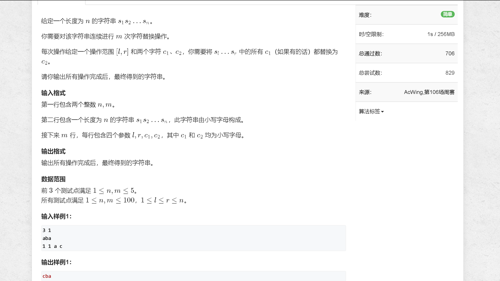
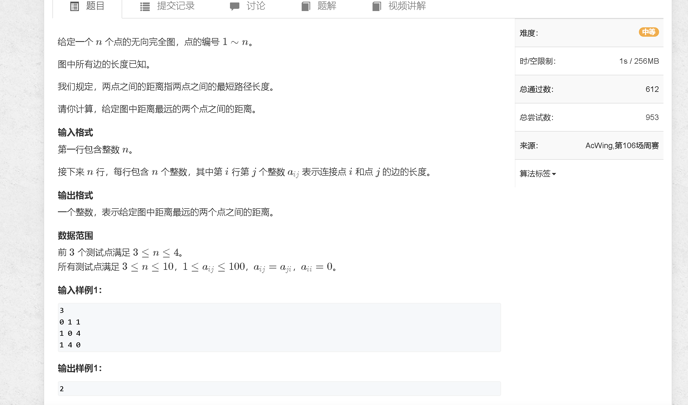

### a

[https://www.acwing.com/problem/content/5035/](https://www.acwing.com/problem/content/5035/)



```java
package com.contest.acw_106;

import java.io.BufferedReader;
import java.io.BufferedWriter;
import java.io.IOException;
import java.io.InputStreamReader;
import java.io.OutputStreamWriter;
import java.math.BigInteger;
import java.util.StringTokenizer;
public class A {
    public static void main(String args[]) throws IOException {
        Read sc = new Read();

        int n = sc.nextInt(), m = sc.nextInt();
        String s = sc.next();
        char[] res = s.toCharArray();
        while (m -- != 0) {
            int l = sc.nextInt(), r = sc.nextInt();
            l --;
            r --;
            String aa = sc.next(), bb = sc.next();
            char a = aa.charAt(0), b = bb.charAt(0);
            for (int i = l; i <= r; i ++) {
                if (res[i] == a) {
                    res[i] = b;
                }
            }
        }
        sc.println(new String(res));

        sc.bw.flush();
        sc.bw.close();


        sc.bw.flush();
        sc.bw.close();
    }
    static class Read{
        BufferedReader bf;
        StringTokenizer st;
        BufferedWriter bw;
        public Read(){
            bf=new BufferedReader(new InputStreamReader(System.in));
            st=new StringTokenizer("");
            bw=new BufferedWriter(new OutputStreamWriter(System.out));
        }
        public String nextLine() throws IOException{
            return bf.readLine();
        }
        public String next() throws IOException{
            while(!st.hasMoreTokens()){
                st=new StringTokenizer(bf.readLine());
            }
            return st.nextToken();
        }
        public int nextInt() throws IOException{
            return Integer.parseInt(next());
        }
        public long nextLong() throws IOException{
            return Long.parseLong(next());
        }
        public double nextDouble() throws IOException{
            return Double.parseDouble(next());
        }
        public BigInteger nextBigInteger() throws IOException{
            return new BigInteger(next());
        }
        public <T> void println(T a) throws IOException{
            bw.write(String.valueOf(a));
            bw.newLine();
            return;
        }
        public <T> void print(T a) throws IOException{
            bw.write(String.valueOf(a));
            return;
        }
        public void print(BigInteger a) throws IOException{
            bw.write(a.toString());
            return;
        }
        public void println(BigInteger a) throws IOException{
            bw.write(a.toString());
            bw.newLine();
            return;
        }
    }
}


```

### b

[https://www.acwing.com/problem/content/5036/](https://www.acwing.com/problem/content/5036/)



```java
import java.util.Scanner;

public class B {
    public static final int N = 15;
    public static int[][] d = new int[N][N];
    
    
    public static void main (String[] args) {
        Scanner sc = new Scanner(System.in);
        
        int n = sc.nextInt();
        
        for (int i = 0; i < n; i ++) {
            for (int j = 0; j < n; j ++) {
                d[i][j] = sc.nextInt();
            }
        }
        
        for (int k = 0; k < n; k ++) {
            for (int i = 0; i < n; i ++) {
                for (int j = 0; j < n; j ++) {
                    d[i][j] = Math.min(d[i][j], d[i][k] + d[k][j]);
                }
            }
        }
        
        int res = 0;
        for (int i = 0; i < n; i ++) {
            for (int j = 0; j < n; j ++) {
                res = Math.max(res, d[i][j]);
            }
        }
        System.out.println(res);
    }
}
```