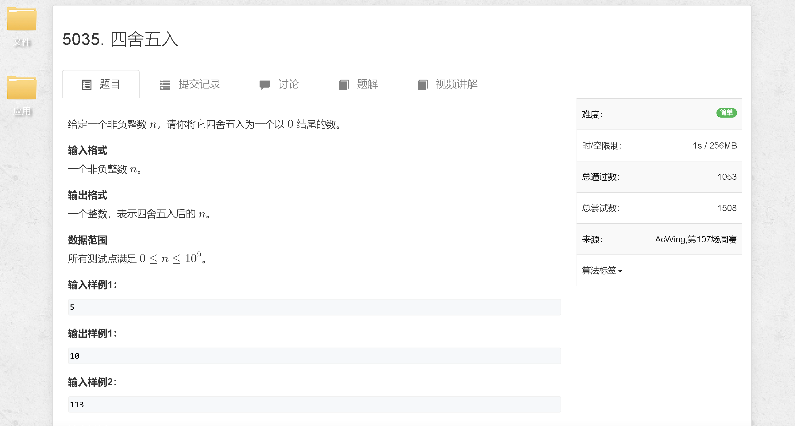
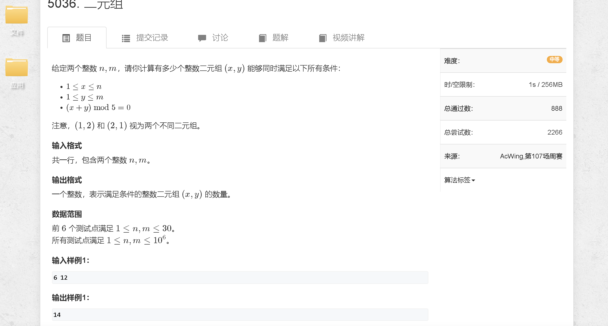
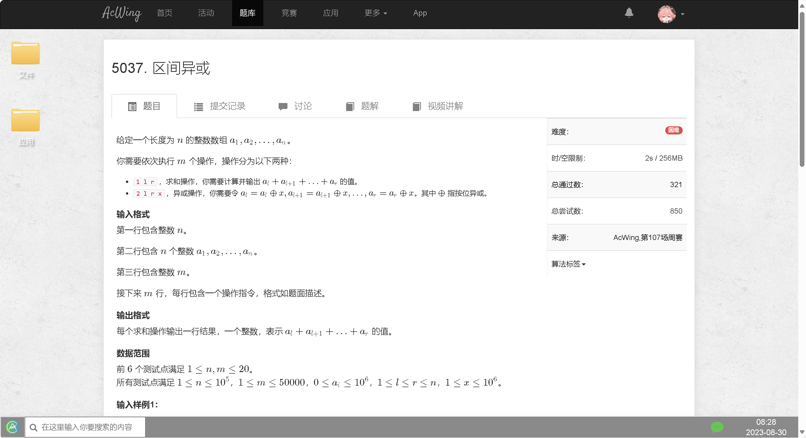

### a

[https://www.acwing.com/problem/content/5038/](https://www.acwing.com/problem/content/5038/)



```java
import java.util.Scanner;

public class Main {
    public static void main (String[] args) {
        Scanner sc = new Scanner(System.in);
        
        long n = sc.nextLong();
        System.out.print((n + 5) / 10 * 10);
    }
}
```

### b

[https://www.acwing.com/problem/content/5039/](https://www.acwing.com/problem/content/5039/)



```java
import java.util.Scanner;

public class Main {
    public static void main (String[] args) {
        Scanner sc = new Scanner(System.in);
        
        int n = sc.nextInt(), m = sc.nextInt();
        
        long res = 0;
        
        for (int i = 1; i <= n; i ++) {
            res += (m - 5 + i % 5) / 5;
            if ((m - 5 + i % 5) >= 0) res ++;
        }
        
        System.out.print(res);
    }
}
```

### c

[https://www.acwing.com/problem/content/5040/](https://www.acwing.com/problem/content/5040/)



```java

```