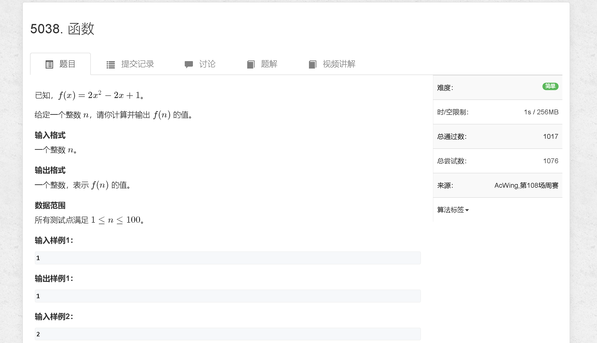
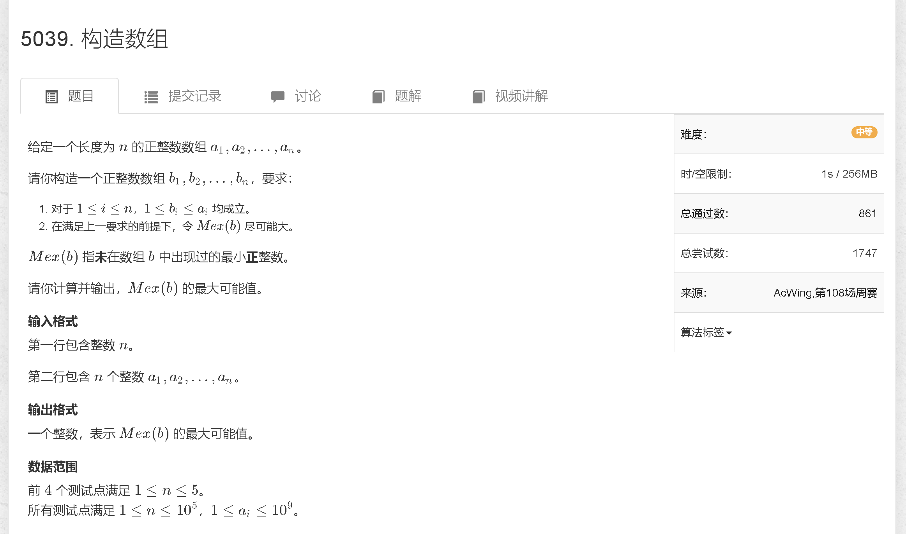
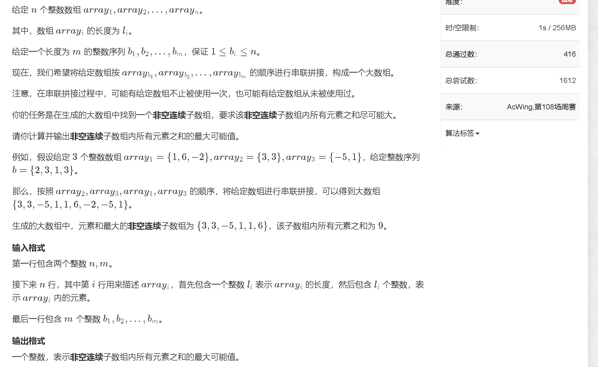

### a

[https://www.acwing.com/problem/content/5041/](https://www.acwing.com/problem/content/5041/)



```java
import java.util.Scanner;

public class Main {
    public static void main (String[] args) {
        Scanner sc = new Scanner(System.in);

        int n = sc.nextInt();
        System.out.println(2 * n * n - 2 * n + 1);
    }
}
```

### b

[https://www.acwing.com/problem/content/5042/](https://www.acwing.com/problem/content/5042/)



```java
import java.util.Scanner;
import java.util.Arrays;

public class Main {
    public static final int N = 100010;
    public static int[] arr = new int[N];
    
    public static void main (String[] args) {
        Scanner sc = new Scanner(System.in);
        
        int n = sc.nextInt();
        int res = 1;
        for (int i = 1; i <= n; i ++) {
            arr[i] = sc.nextInt();
        }
        
        Arrays.sort(arr, 1, n + 1);
        for (int i = 2; i <= n; i ++) {
            if (res < arr[i]) res ++;
        }
        
        System.out.print(res + 1);
    }
}
```

### c

[https://www.acwing.com/problem/content/5043/](https://www.acwing.com/problem/content/5043/)



```java

```
