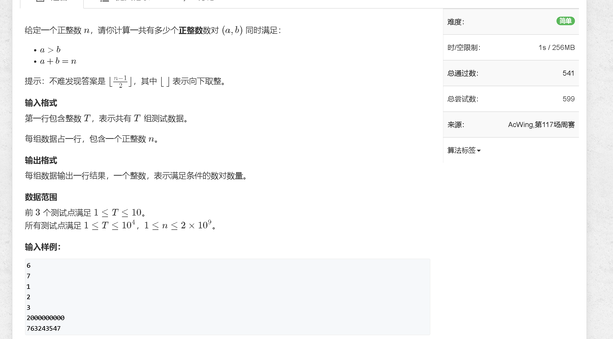
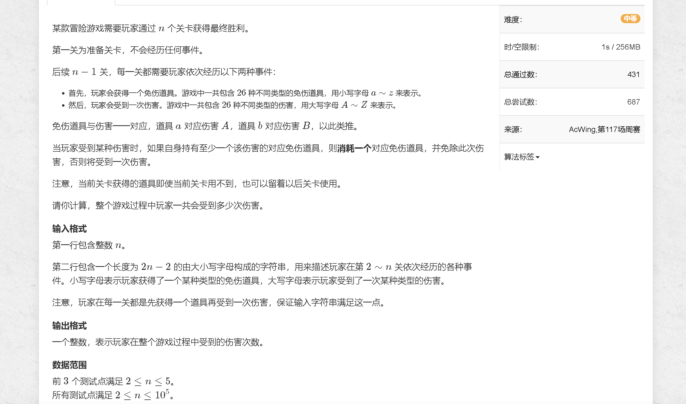
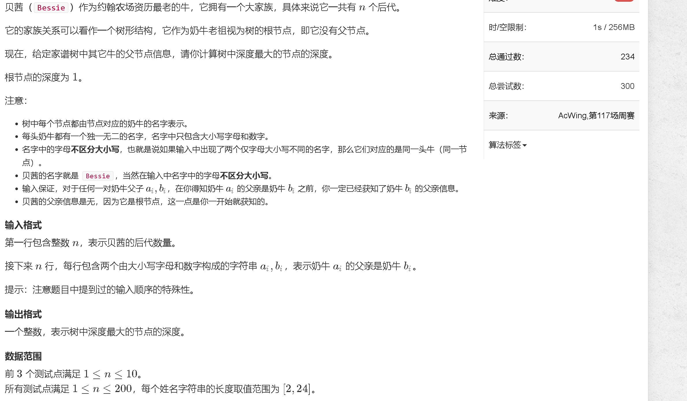

### a

[https://www.acwing.com/problem/content/5140/](https://www.acwing.com/problem/content/5140/)



```java
import java.util.Scanner;

public class Main {
    public static void main (String[] args) {
        Scanner sc = new Scanner(System.in);
        
        int t = sc.nextInt();
        while (t -- != 0) {
            int n = sc.nextInt();
            System.out.println((n - 1) / 2);
        }
    }
}
```

### b

[https://www.acwing.com/problem/content/5141/](https://www.acwing.com/problem/content/5141/)



```java
import java.util.Scanner;

public class Main {
    public static void main (String[] args) {
        Scanner  sc = new Scanner(System.in);
        
        int n = sc.nextInt();
        String s = sc.next();
        
        int[] arr = new int[26];
        // if (s.charAt(0) >= 'a' && s.charAt(0) <= 'z') arr[s.charAt(0) - 'a'] ++;
        int res = 0;
        for (int i = 1; i < s.length(); i ++) {
            char c = s.charAt(i);
            if (c >= 'a' && c <= 'z') arr[c - 'a'] ++;
            else {
                int id = c - 'A';
                if (arr[id] > 0) arr[id] --;
                else res ++;
            }
        }
        System.out.println(res);
    }
}
```


### c

[https://www.acwing.com/problem/content/5142/](https://www.acwing.com/problem/content/5142/)



```java

```