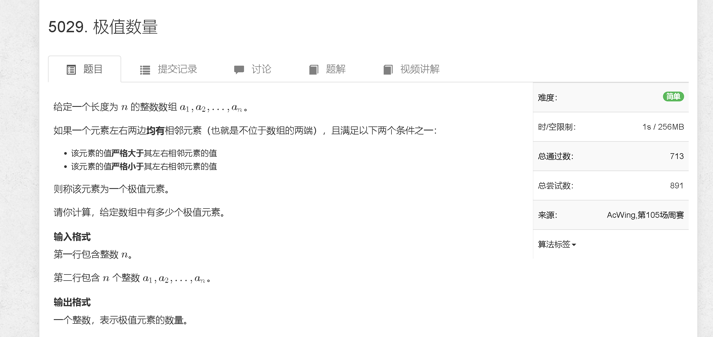
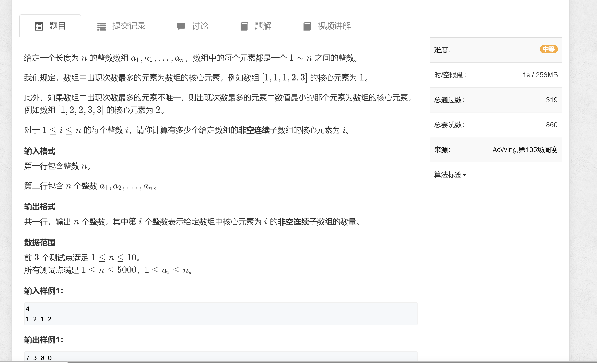

### A
[https://www.acwing.com/problem/content/5032/](https://www.acwing.com/problem/content/5032/)



```java
package com.contest.acw_73;

import java.io.BufferedReader;
import java.io.BufferedWriter;
import java.io.IOException;
import java.io.InputStreamReader;
import java.io.OutputStreamWriter;
import java.math.BigInteger;
import java.util.StringTokenizer;
public class A {
    public static void main(String args[]) throws IOException {
        Read sc = new Read();

        int n = sc.nextInt();
        int[] arr = new int[n + 2];
        int res = 0;

        for (int i = 1; i <= n; i ++) arr[i] = sc.nextInt();

        for (int i = 2; i < n; i ++) {
            if ((arr[i] > arr[i + 1] && arr[i] > arr[i - 1])  || (arr[i] < arr[i + 1] && arr[i] < arr[i - 1])) res ++;
        }
        sc.println(res);

        sc.bw.flush();
        sc.bw.close();
    }
    static class Read{
        BufferedReader bf;
        StringTokenizer st;
        BufferedWriter bw;
        public Read(){
            bf=new BufferedReader(new InputStreamReader(System.in));
            st=new StringTokenizer("");
            bw=new BufferedWriter(new OutputStreamWriter(System.out));
        }
        public String nextLine() throws IOException{
            return bf.readLine();
        }
        public String next() throws IOException{
            while(!st.hasMoreTokens()){
                st=new StringTokenizer(bf.readLine());
            }
            return st.nextToken();
        }
        public int nextInt() throws IOException{
            return Integer.parseInt(next());
        }
        public long nextLong() throws IOException{
            return Long.parseLong(next());
        }
        public double nextDouble() throws IOException{
            return Double.parseDouble(next());
        }
        public BigInteger nextBigInteger() throws IOException{
            return new BigInteger(next());
        }
        public <T> void println(T a) throws IOException{
            bw.write(String.valueOf(a));
            bw.newLine();
            return;
        }
        public <T> void print(T a) throws IOException{
            bw.write(String.valueOf(a));
            return;
        }
        public void print(BigInteger a) throws IOException{
            bw.write(a.toString());
            return;
        }
        public void println(BigInteger a) throws IOException{
            bw.write(a.toString());
            bw.newLine();
            return;
        }
    }
}

```

### B
[https://www.acwing.com/problem/content/5033/](https://www.acwing.com/problem/content/5033/)



```java
package com.contest.acw_73;

import java.util.Scanner;

public class B {
    public static final int N = 5010;
    public static int[] arr = new int[N];
    public static int[] res = new int[N];


    public static void main (String[] args) {
        Scanner sc = new Scanner(System.in);

        int n = sc.nextInt();

        for (int i = 1; i <= n; i ++) {
            arr[i] = sc.nextInt();
        }

        for (int i = 1; i <= n; i ++) {
            int id = 0, cnta = 0;
            int[] cnt = new int[n + 10];
            for (int j = i; j <= n; j ++) {

                cnt[arr[j]] ++;

                if (cnt[arr[j]] > cnta || (cnt[arr[j]] == cnta && id > arr[j] )) {
                    id = arr[j];
                    cnta = cnt[arr[j]];
                }

                res[id] ++;
            }
        }


        for (int i = 1; i <= n; i ++) System.out.print(res[i] + " ");
    }
}
```