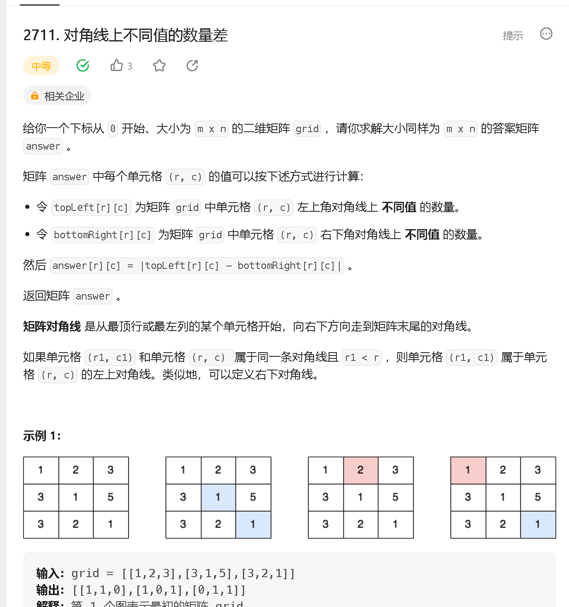
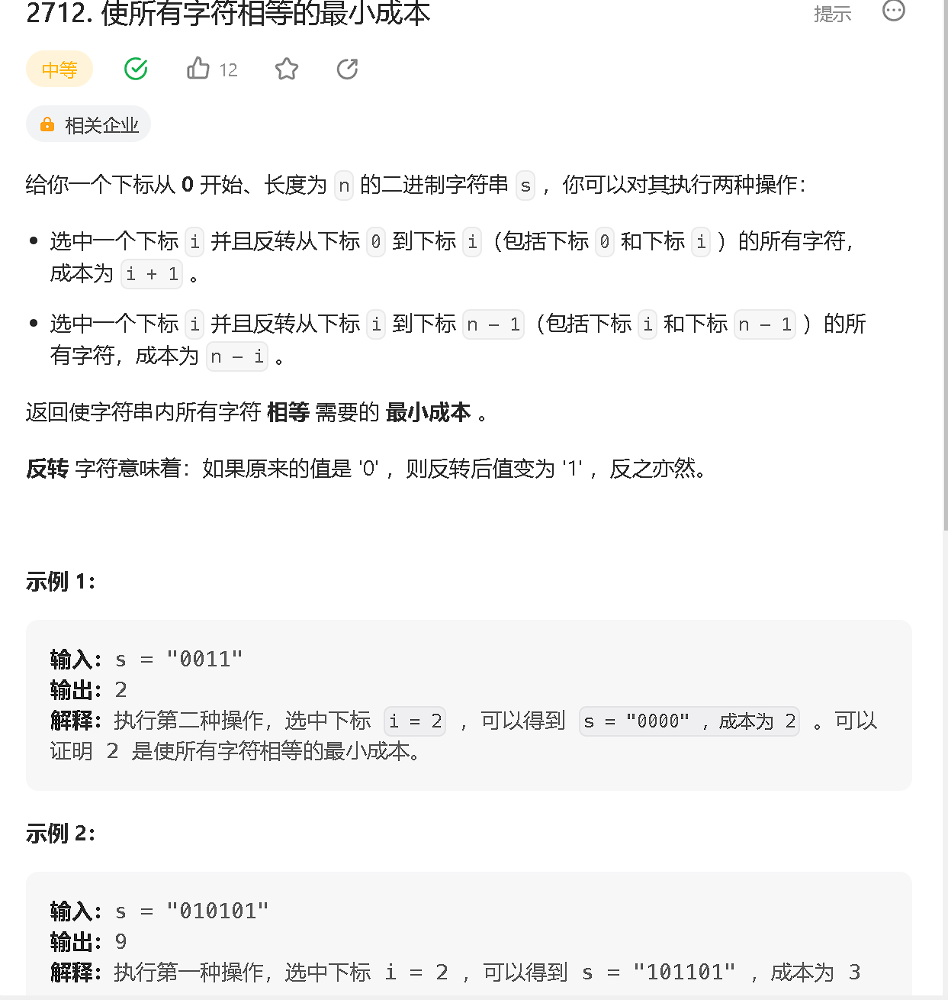

#### a

[https://leetcode.cn/problems/remove-trailing-zeros-from-a-string/](https://leetcode.cn/problems/remove-trailing-zeros-from-a-string/)


```java
class Solution {
    public String removeTrailingZeros(String num) {
        int n = num.length() - 1;
        while (n >= 0 && num.charAt(n) == '0') n --;
        return num.substring(0, n + 1);
    }
}
```
#### b

[https://leetcode.cn/problems/difference-of-number-of-distinct-values-on-diagonals/](https://leetcode.cn/problems/difference-of-number-of-distinct-values-on-diagonals/)



```java
class Solution {
    public int[][] differenceOfDistinctValues(int[][] arr) {
        int n = arr.length, m = arr[0].length;
        
        int[][] res = new int[n][m];
        
        for (int i = 0; i < n; i ++) {
            for (int j = 0; j < m; j ++) {
                Set<Integer> set = new HashSet<>();
                Set<Integer> set1 = new HashSet<>();
                
                int x = i - 1, y = j - 1;
                int x1 = i + 1, y1 = j + 1;
                while (x >= 0 && y >= 0) {
                    set.add(arr[x][y]);
                    x --;
                    y --;
                }
                while (x1 < n && y1 < m) {
                    set1.add(arr[x1][y1]);
                    x1 ++;
                    y1 ++;
                }
                
                res[i][j] = Math.abs(set.size() - set1.size());
            }
        }
        return res;
    }
}
```

#### c

[https://leetcode.cn/problems/minimum-cost-to-make-all-characters-equal/](https://leetcode.cn/problems/minimum-cost-to-make-all-characters-equal/)



```java
class Solution {
    public long minimumCost(String s) {
        long res = 0;
        int n = s.length();

        for (int i = 1; i < n; i ++) {
            if (s.charAt(i) != s.charAt(i - 1)) res += Math.min(n - i, i);
        }
        return res;
    }
}
```

