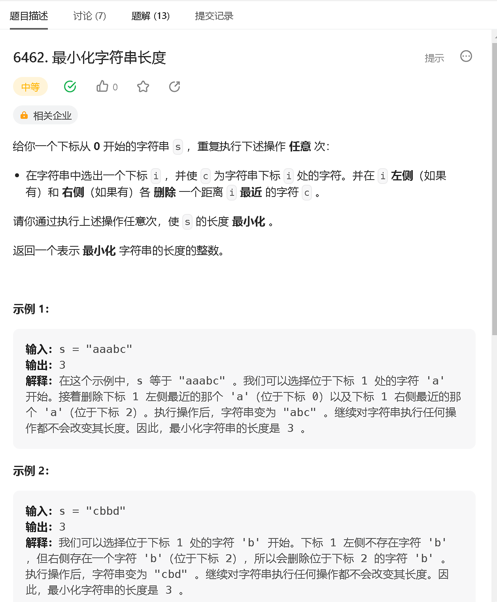
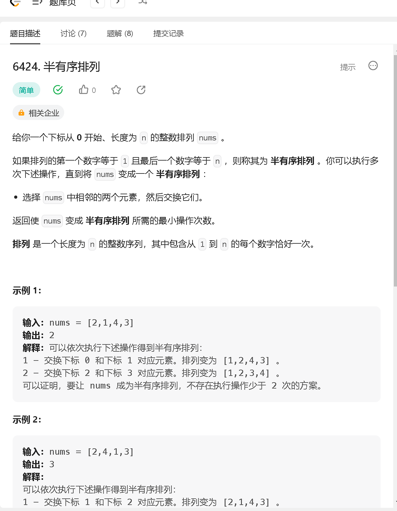
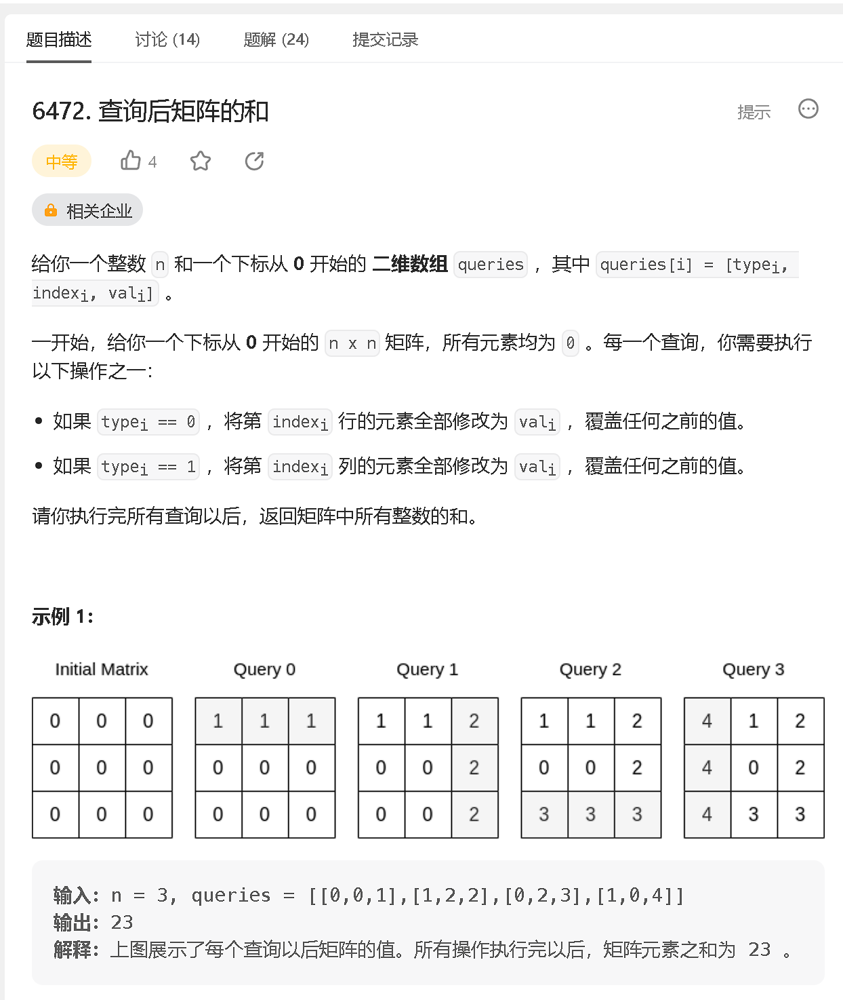

### a

[https://leetcode.cn/problems/minimize-string-length/](https://leetcode.cn/problems/minimize-string-length/)



```java
class Solution {
    public int minimizedStringLength(String s) {
        int[] cnt = new int[26];
        
        for (char c : s.toCharArray()) {
            cnt[c - 'a'] ++;
        }
        int res = 0;
        for (int i = 0; i < 26; i ++) {
            if (cnt[i] != 0) res ++;
        }
        return res;

    }
}
```

### b

[https://leetcode.cn/problems/semi-ordered-permutation/](https://leetcode.cn/problems/semi-ordered-permutation/)



```java
class Solution {
    public int semiOrderedPermutation(int[] nums) {
        
        int n = nums.length; 
        
        int idmin = -1, idmax = -1;
        int minv = 55, maxv = 0;
        for (int i = 0; i < n; i ++) {
            if (nums[i] > maxv) {
                maxv = nums[i];
                idmax = i;
            }
            if (nums[i] < minv) {
                minv = nums[i];
                idmin = i;
            }
        }
        
        if (idmin < idmax) {
            return idmin + n - idmax - 1;
        } else {
            return idmin + n - idmax - 2;
        }
        
    }
}
```

### c

[https://leetcode.cn/problems/sum-of-matrix-after-queries/](https://leetcode.cn/problems/sum-of-matrix-after-queries/)



```java
class Solution {
    public long matrixSumQueries(int n, int[][] queries) {
        long res = 0;

        Set<Integer> setc = new HashSet<>();
        Set<Integer> setr = new HashSet<>();

        for (int i = queries.length - 1; i >= 0; i --) {
            int idex = queries[i][1], val =  queries[i][2];

            if (queries[i][0] == 0 && !setr.contains(idex)) {
                res += (long)(n - setc.size()) * val;
                setr.add(idex);
            } else if (queries[i][0] == 1 && !setc.contains(idex)){
                res += (long)(n - setr.size()) * val;
                setc.add(idex);
            }
        }

        return res;
    }
}
/*
如果对同一行反复操作，那么只有最后一次对这行的操作会计入答案。列同理。
如果对每一行来说， 有两次情况 
如果第一次出现，我们就 让 res += ( n -  之前操作过的列) * val
如果不是第一次出现, 说明之前已经操作过了， 就跳过
 */
```