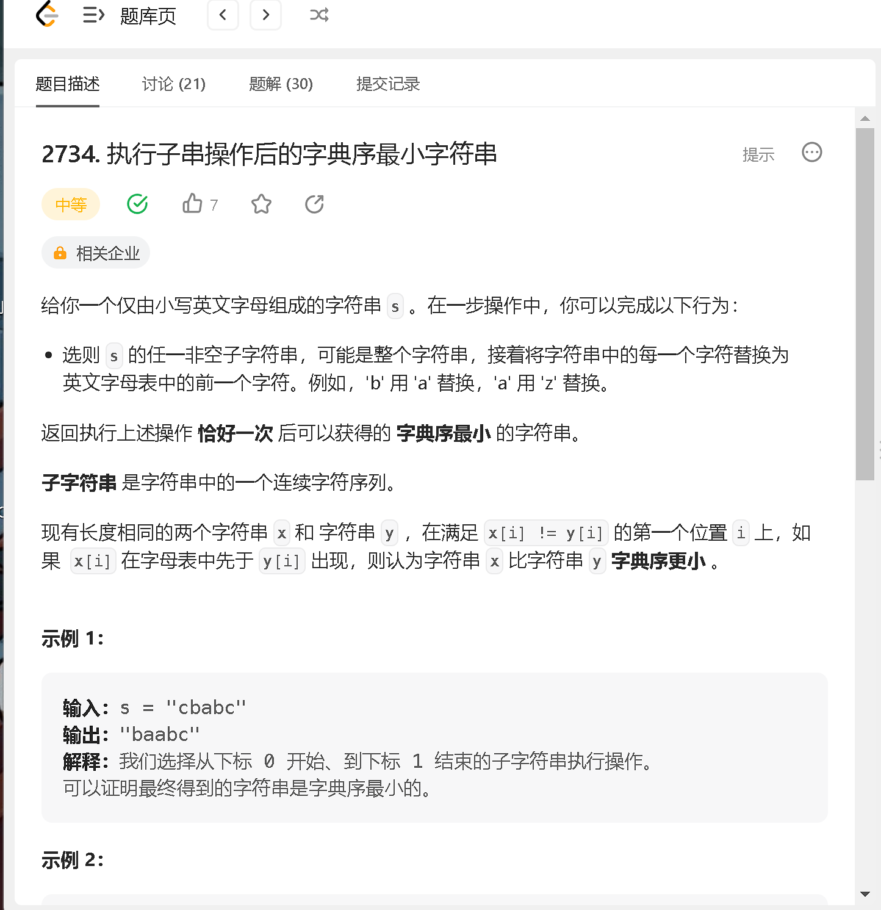

### a


```java
class Solution {
    public int findNonMinOrMax(int[] nums) {
        int n = nums.length;
        if (n <= 2) return -1;
        Arrays.sort(nums);
        for (int i = 1; i < n - 1; i ++) {
            if (nums[i] != nums[i - 1] && nums[i] != nums[i + 1]) return nums[i];
        }
        return -1;
    }
}
```

### b



```java
class Solution {
    public String smallestString(String s) {
        int n = s.length();
        StringBuilder res = new StringBuilder();

        int idex = 0;
        while (idex < n && s.charAt(idex) == 'a') {
            idex ++;
            res.append('a');
        }
        if (idex == n) {
            res.setCharAt(n - 1, 'z');
            return res.toString();
        }
        int st = idex;
        while (st < n && s.charAt(st) != 'a') {
            res.append((char)(s.charAt(st) - 'a' - 1 + 'a'));
            st ++;
        }
        while (st < n) {
            res.append(s.charAt(st));
            st ++;
        }

        return res.toString();
    }
}
```
