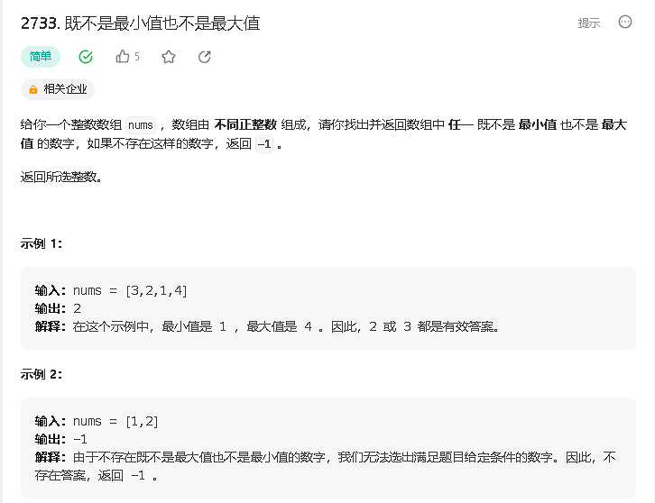
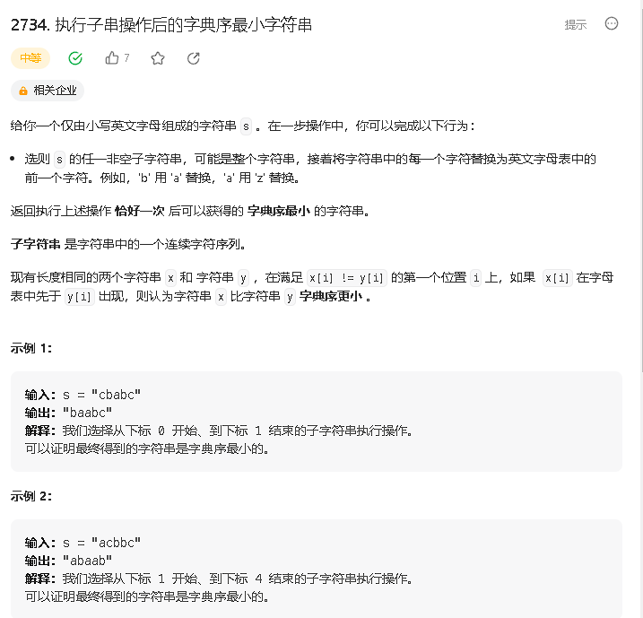
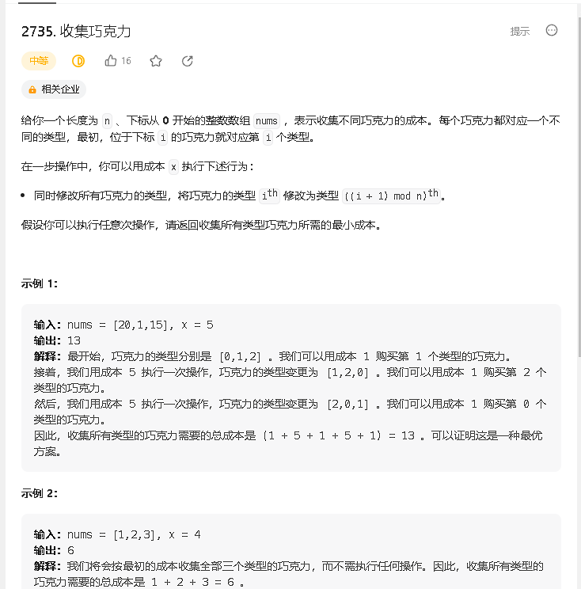
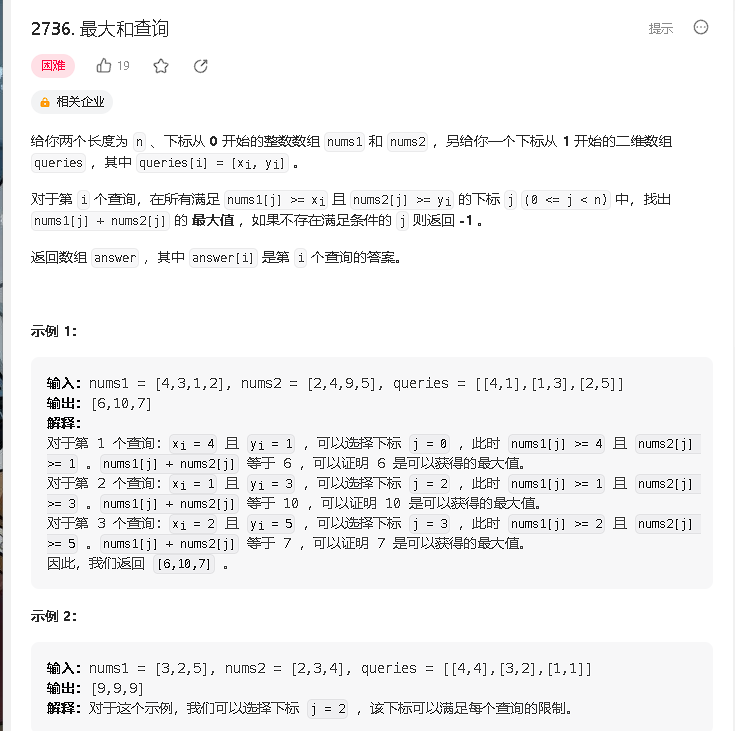

### a

[https://leetcode.cn/problems/neither-minimum-nor-maximum/](https://leetcode.cn/problems/neither-minimum-nor-maximum/)



```java
class Solution {
    public int findNonMinOrMax(int[] nums) {
        int n = nums.length;
        if (n <= 2) return -1;
        Arrays.sort(nums);
        for (int i = 1; i < n - 1; i ++) {
            if (nums[i] != nums[i - 1] && nums[i] != nums[i + 1]) return nums[i];
        }
        return -1;
    }
}
```

### b

[https://leetcode.cn/problems/lexicographically-smallest-string-after-substring-operation/](https://leetcode.cn/problems/lexicographically-smallest-string-after-substring-operation/)



```java
class Solution {
    public String smallestString(String s) {
        int n = s.length();
        
        char[] arr = s.toCharArray();
        int st = -1;
        for (int i = 0; i < n; i ++) {
            if (arr[i] != 'a') {
                st = i;
                break;
            }
        }

        if (st == -1) {
            arr[n - 1] = 'z';
            return new String(arr);
        }

        for (int i = st; i < n && arr[i] != 'a'; i ++) {
            arr[i] = (char)(arr[i]  - 'a' - 1 + 'a');
        }
        return new String(arr);

    }
}
```

### c 

[https://leetcode.cn/problems/collecting-chocolates/](https://leetcode.cn/problems/collecting-chocolates/)



```java

```


### d

[https://leetcode.cn/problems/maximum-sum-queries/](https://leetcode.cn/problems/maximum-sum-queries/)




```java

```
