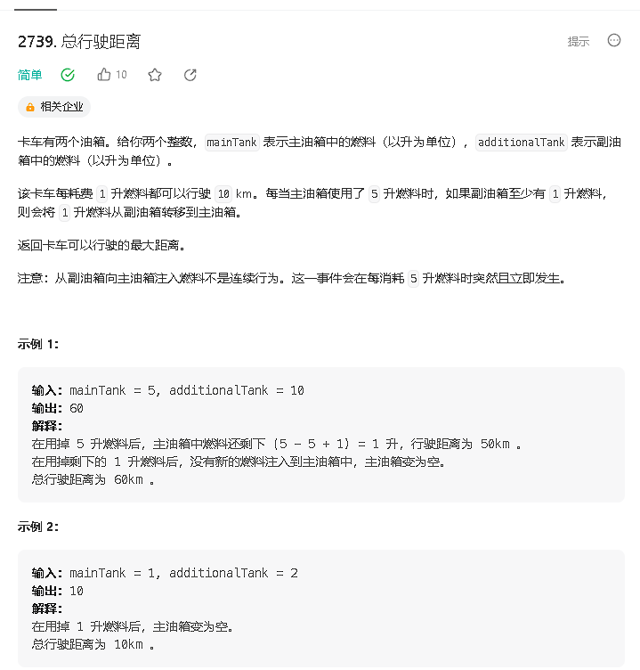

### a

[https://leetcode.cn/problems/total-distance-traveled/description/](https://leetcode.cn/problems/total-distance-traveled/description/)


    
```java
class Solution {
    public int distanceTraveled(int mainTank, int additionalTank) {
        return (Math.min(additionalTank, (mainTank - 1) / 4) + mainTank) * 10;
    }
}
```

### b

[https://leetcode.cn/problems/find-the-value-of-the-partition/](https://leetcode.cn/problems/find-the-value-of-the-partition/)


```java
class Solution {
    public int findValueOfPartition(int[] nums) {
        Arrays.sort(nums);
        int res = Integer.MAX_VALUE;
        for (int i = 1; i < nums.length; i ++) {
            res = Math.min(res, nums[i] - nums[i - 1]);
        }
        return res;
    }
}
```

### c

[https://leetcode.cn/problems/special-permutations/](https://leetcode.cn/problems/special-permutations/)


```java

```

### d 

[https://leetcode.cn/problems/painting-the-walls/](https://leetcode.cn/problems/painting-the-walls/)


```java

```
