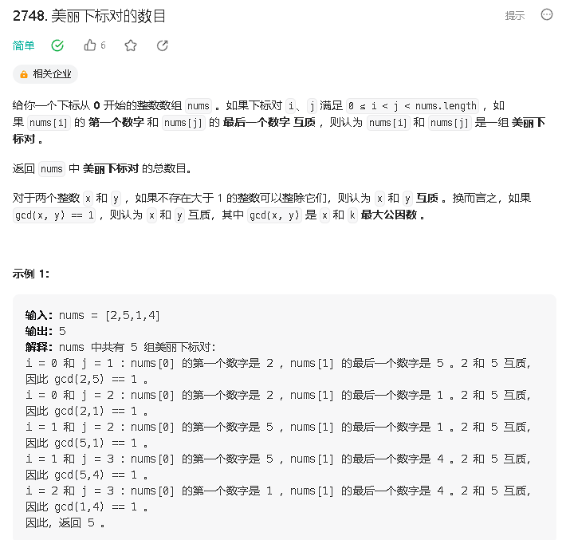

### a

[https://leetcode.cn/problems/number-of-beautiful-pairs/description/](https://leetcode.cn/problems/number-of-beautiful-pairs/description/)



```java
class Solution {
    public int countBeautifulPairs(int[] nums) {
        int res = 0;
        int[] cnt = new int[10];
        for (int i = 0; i < nums.length; i ++) {
            int x = nums[i];
            for (int j = 0; j < 10; j ++) {
                if(cnt[j] > 0 && gcd(x % 10, j) == 1) {
                    res += cnt[j];
                }
            }
            while (x >= 10) x /= 10;
            cnt[x]++;
        }
        return res;
    }
    public int gcd(int a, int b) {
        return b == 0 ? a : gcd(b, a % b);
    }
}
```

