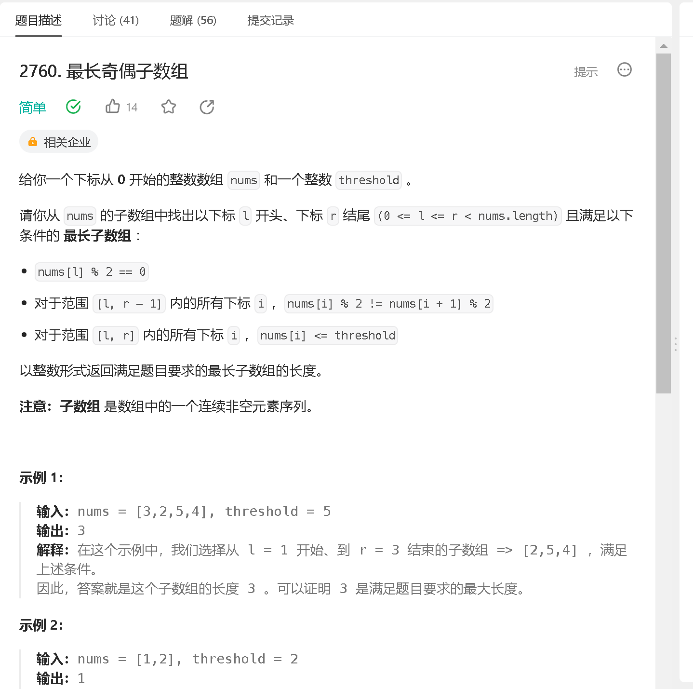
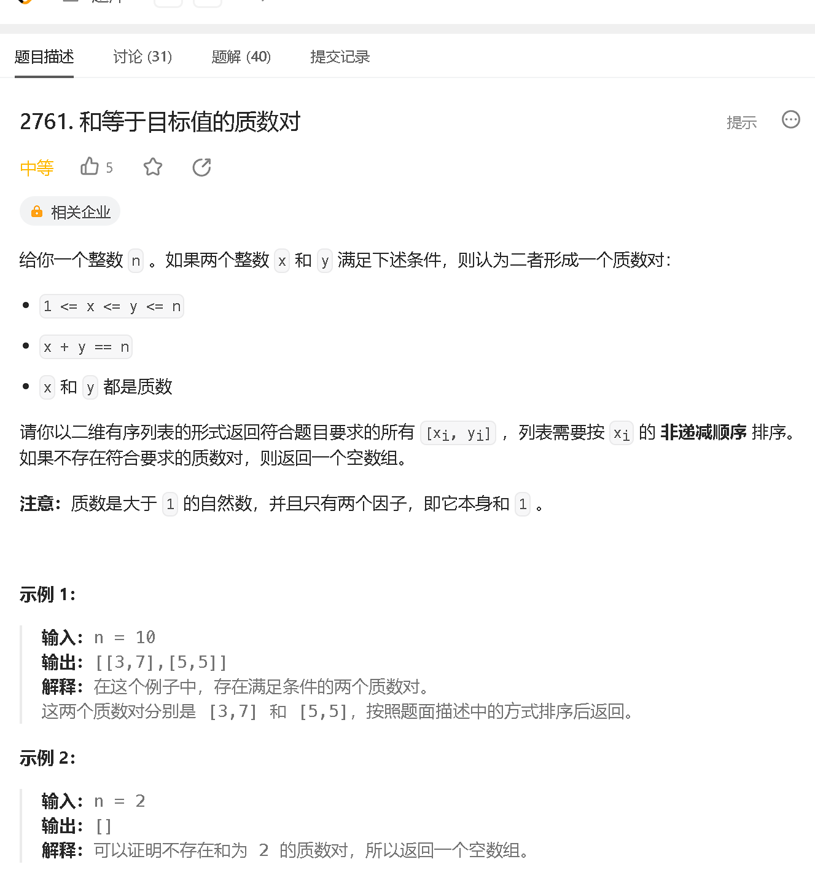
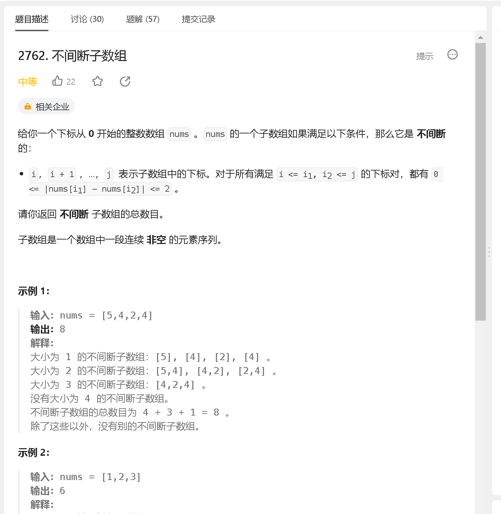
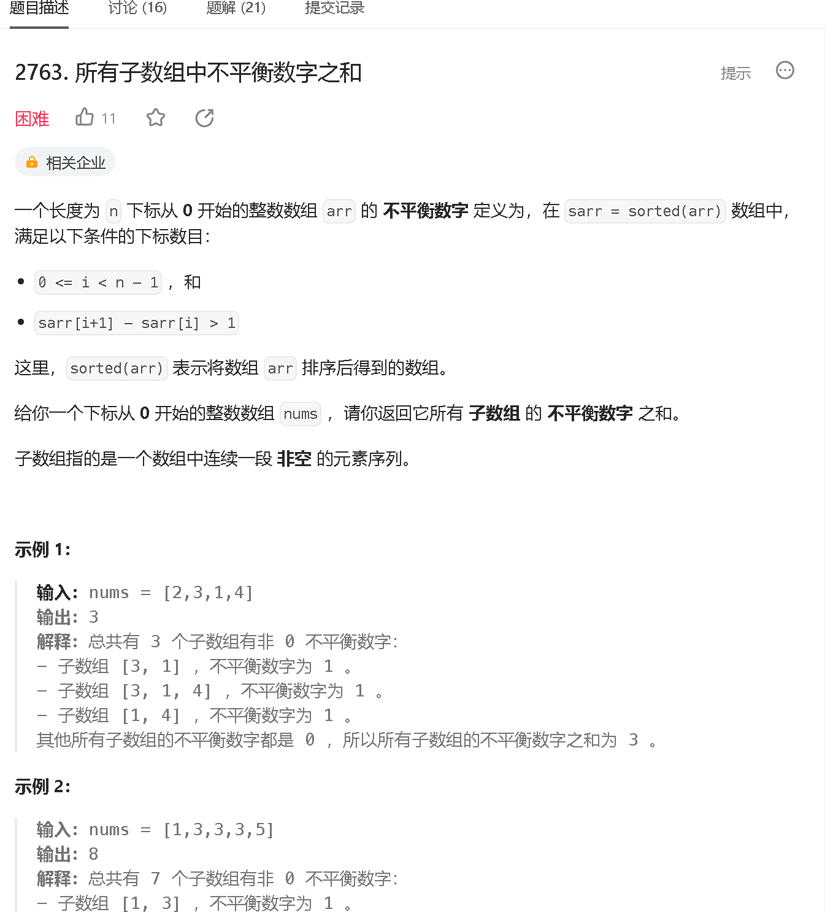

### a

[https://leetcode.cn/problems/longest-even-odd-subarray-with-threshold/description/](https://leetcode.cn/problems/longest-even-odd-subarray-with-threshold/description/)



```java
class Solution {
    public int longestAlternatingSubarray(int[] nums, int threshold) {
        int n = nums.length;
        int ans = 0;
        int l = 0;
        while (l < n) {
            if (nums[l] % 2 != 0 || nums[l] > threshold) {
                ++l;

                continue;
            }

            int r = l + 1;
            while (r < n) {
                if (nums[r] > threshold || nums[r - 1] % 2 == nums[r] % 2)
                    break;

                ++r;
            }

            ans = Math.max(ans, r - l);

            l = r;
        }

        return ans;
    }
}
```

### b

[https://leetcode.cn/problems/prime-pairs-with-target-sum/](https://leetcode.cn/problems/prime-pairs-with-target-sum/)



```java

```

### c

[https://leetcode.cn/problems/continuous-subarrays/](https://leetcode.cn/problems/continuous-subarrays/)



```java

```

### d 

[https://leetcode.cn/problems/sum-of-imbalance-numbers-of-all-subarrays/](https://leetcode.cn/problems/sum-of-imbalance-numbers-of-all-subarrays/)



```java

```