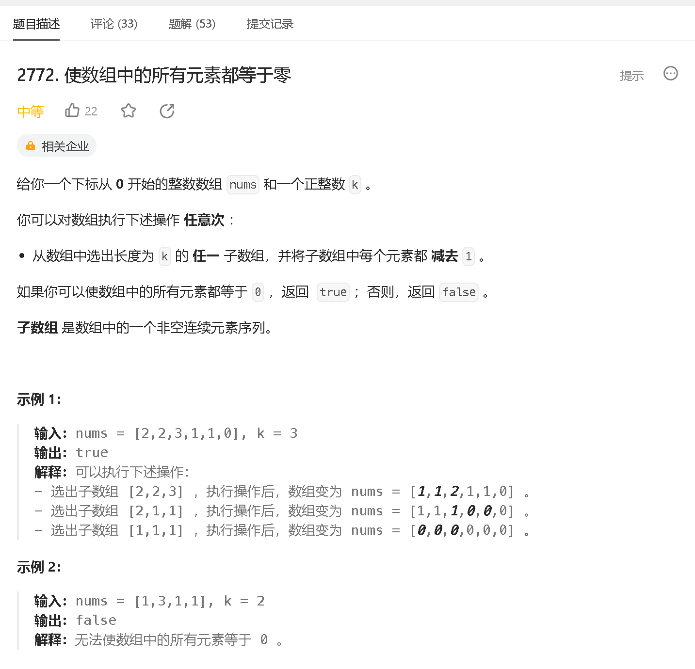

### a

[https://leetcode.cn/problems/find-the-maximum-achievable-number/](https://leetcode.cn/problems/find-the-maximum-achievable-number/)


```java
class Solution {
    public int theMaximumAchievableX(int num, int t) {
        return num + 2 * t;
    }
}
```

### b

[https://leetcode.cn/problems/maximum-number-of-jumps-to-reach-the-last-index/description/](https://leetcode.cn/problems/maximum-number-of-jumps-to-reach-the-last-index/description/)


```java
class Solution {
    public int maximumJumps(int[] nums, int target) {
        int n = nums.length;

        int[] dp = new int[n];   // dp[i] 表示从 0 到 i 的最大跳跃次数
        Arrays.fill(dp, -1);    // -1 到不了
        
        dp[0] = 0;
        for (int i = 1; i < n ; i ++) {
            for (int j = 0; j < i; j ++) {
                if (Math.abs(nums[i] - nums[j]) <= target && dp[j] != -1) {
                    dp[i] = Math.max(dp[i], dp[j] + 1);
                }
            }
        }

        return dp[n - 1];
    }
}
```

### c

[https://leetcode.cn/problems/longest-non-decreasing-subarray-from-two-arrays/](https://leetcode.cn/problems/longest-non-decreasing-subarray-from-two-arrays/)


```java

```


### d

[https://leetcode.cn/problems/apply-operations-to-make-all-array-elements-equal-to-zero/](https://leetcode.cn/problems/apply-operations-to-make-all-array-elements-equal-to-zero/)



```java

```