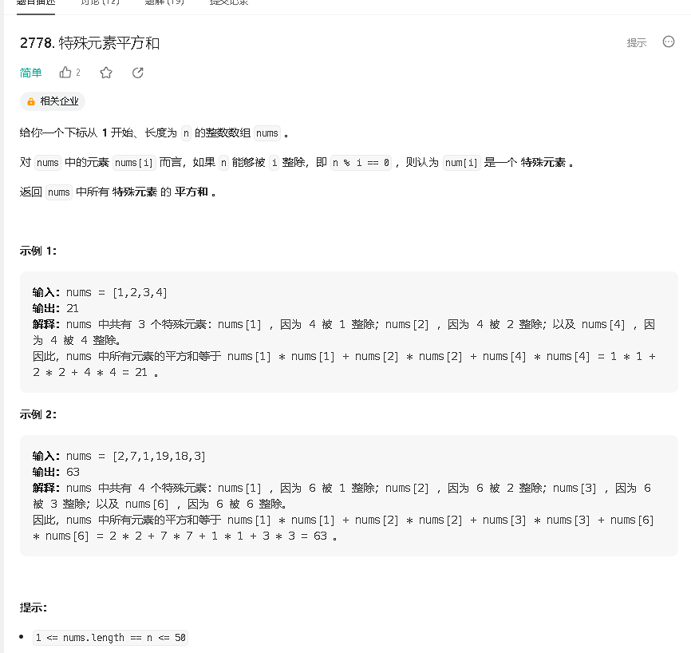
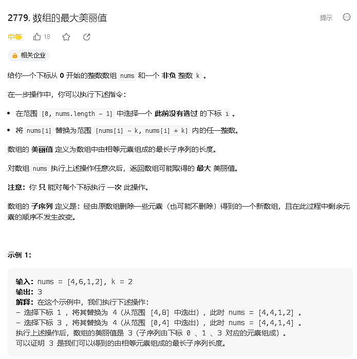
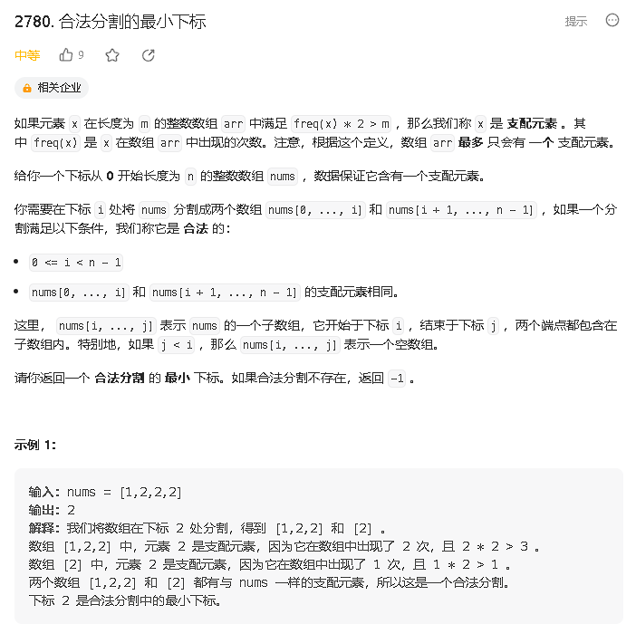
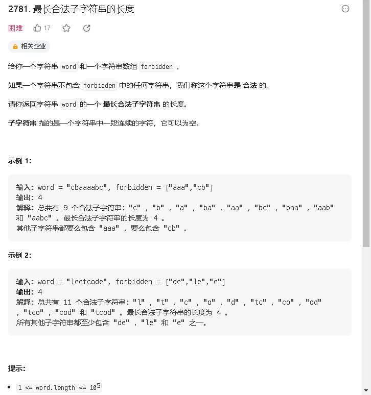

### a

[https://leetcode.cn/problems/sum-of-squares-of-special-elements/](https://leetcode.cn/problems/sum-of-squares-of-special-elements/)



```java
class Solution {
    public int sumOfSquares(int[] nums) {
        int res = 0;
        int n = nums.length;
        for (int i = 0; i < n; i ++) {
            if (n % (i + 1) == 0) {
                res += nums[i] * nums[i];
            }
        }
        return res;
    }
}
```

### b

[https://leetcode.cn/problems/maximum-beauty-of-an-array-after-applying-operation/](https://leetcode.cn/problems/maximum-beauty-of-an-array-after-applying-operation/)



```java

```

### c

[https://leetcode.cn/problems/minimum-index-of-a-valid-split/](https://leetcode.cn/problems/minimum-index-of-a-valid-split/)



```java

```


### d

[https://leetcode.cn/problems/length-of-the-longest-valid-substring/](https://leetcode.cn/problems/length-of-the-longest-valid-substring/)



```java

```


