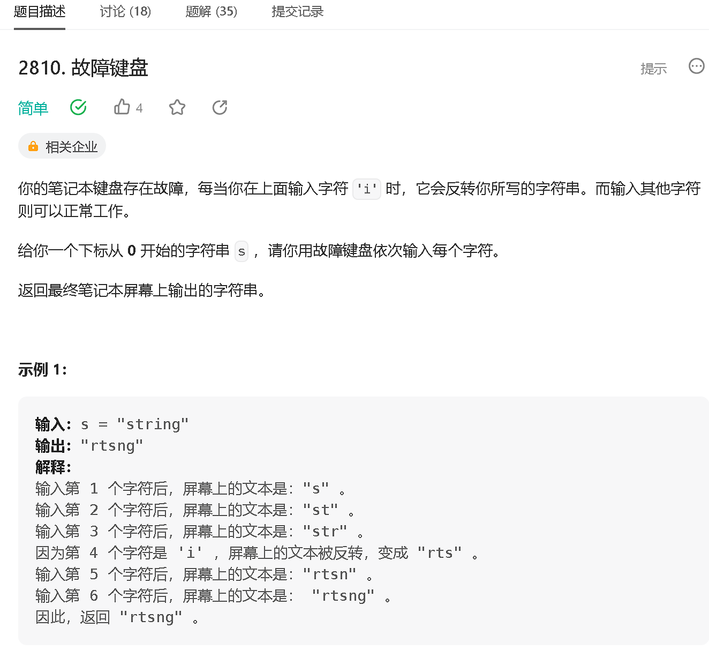
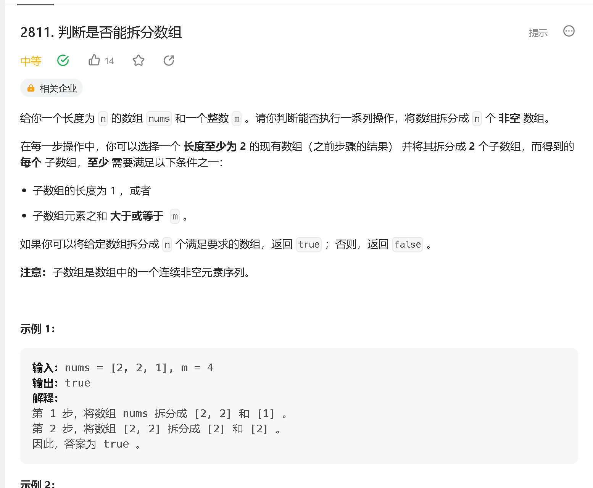
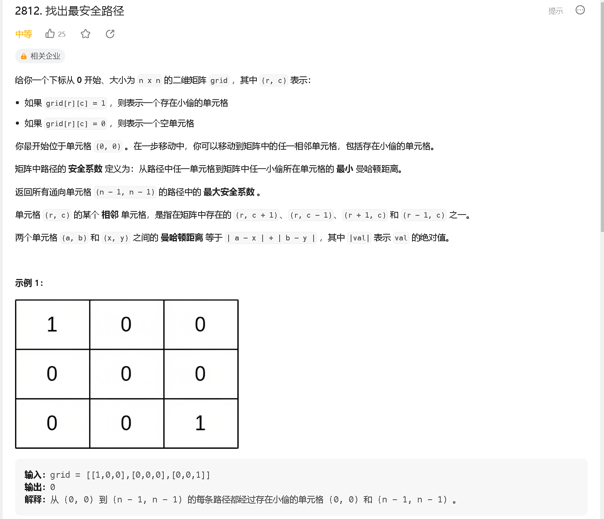
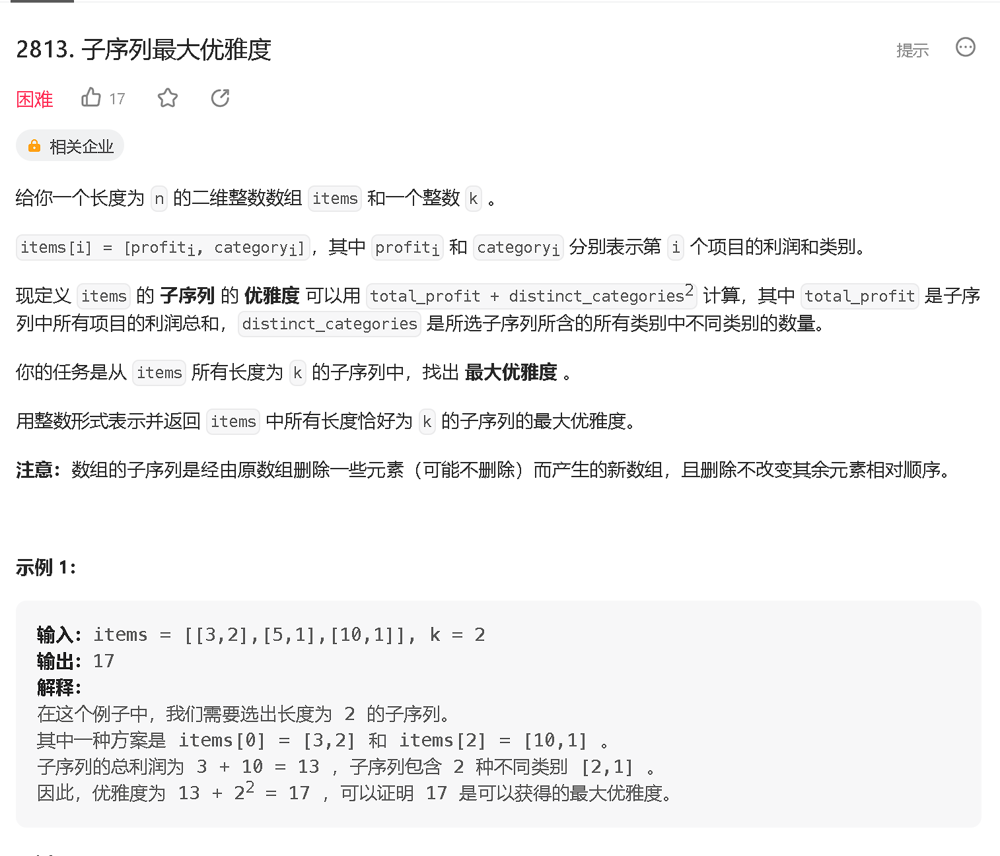

### a

[https://leetcode.cn/problems/faulty-keyboard/](https://leetcode.cn/problems/faulty-keyboard/)



```java
class Solution {
    public String finalString(String s) {
        int n = s.length();

        StringBuilder res = new StringBuilder();
        for (int i = 0; i < n; i ++) {
            if (s.charAt(i) != 'i') {
                res.append(s.charAt(i));
            } else {
                res.reverse();
            }
        }
        return res.toString();
    }
}
```

### b

[https://leetcode.cn/problems/check-if-it-is-possible-to-split-array/description/](https://leetcode.cn/problems/check-if-it-is-possible-to-split-array/description/)




```java
class Solution {
    public boolean canSplitArray(List<Integer> nums, int m) {
        int n = nums.size();
        
        if (n <= 2) return true;
        for (int i = 1; i < n ; i ++) {
            if (nums.get(i) + nums.get(i - 1) >= m ) return true;;
        }
        return false;
    }
}
```

### c

[https://leetcode.cn/problems/find-the-safest-path-in-a-grid/](https://leetcode.cn/problems/find-the-safest-path-in-a-grid/)



```java

```

### d

[https://leetcode.cn/problems/maximum-elegance-of-a-k-length-subsequence/](https://leetcode.cn/problems/maximum-elegance-of-a-k-length-subsequence/)



```java

```