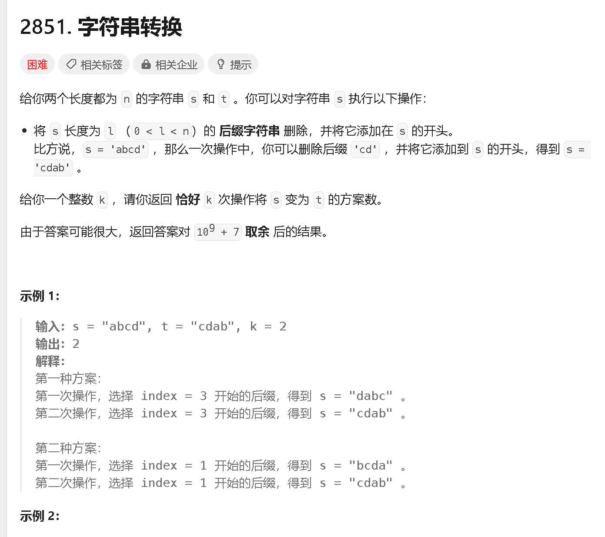

### a

[https://leetcode.cn/problems/points-that-intersect-with-cars/description/](https://leetcode.cn/problems/points-that-intersect-with-cars/description/)


```java
class Solution {
    public int numberOfPoints(List<List<Integer>> nums) {
        int[] arr = new int[101];

        for (List<Integer> list : nums) {
            for (int i = list.get(0); i <= list.get(1); i ++) {
                arr[i] ++;
            }
        }
        int res = 0;
        for (int i = 0; i < 101; i ++) {
            res += arr[i] > 0 ? 1 : 0;
        }
        return res;
    }
}
```

```java
class Solution {
    public int numberOfPoints(List<List<Integer>> nums) {
        var diff = new int[102];
        for (var p : nums) {
            diff[p.get(0)]++;
            diff[p.get(1) + 1]--;
        }
        int ans = 0, s = 0;
        for (int d : diff) {
            s += d;
            if (s > 0) {
                ans++;
            }
        }
        return ans;
    }
}
```

### b

[https://leetcode.cn/problems/determine-if-a-cell-is-reachable-at-a-given-time/description/](https://leetcode.cn/problems/determine-if-a-cell-is-reachable-at-a-given-time/description/)


```java
class Solution {
    public boolean isReachableAtTime(int sx, int sy, int fx, int fy, int t) {
        if (sx == fx && sy == fy) {
            return t != 1;
        }
        int max = Math.max(Math.abs(sx - fx), Math.abs(sy - fy));
        return max <= t;
    }
}
```

### c

[https://leetcode.cn/problems/minimum-moves-to-spread-stones-over-grid/description/](https://leetcode.cn/problems/minimum-moves-to-spread-stones-over-grid/description/)


```java

```


### d

[https://leetcode.cn/problems/string-transformation/description/](https://leetcode.cn/problems/string-transformation/description/)



```java

```