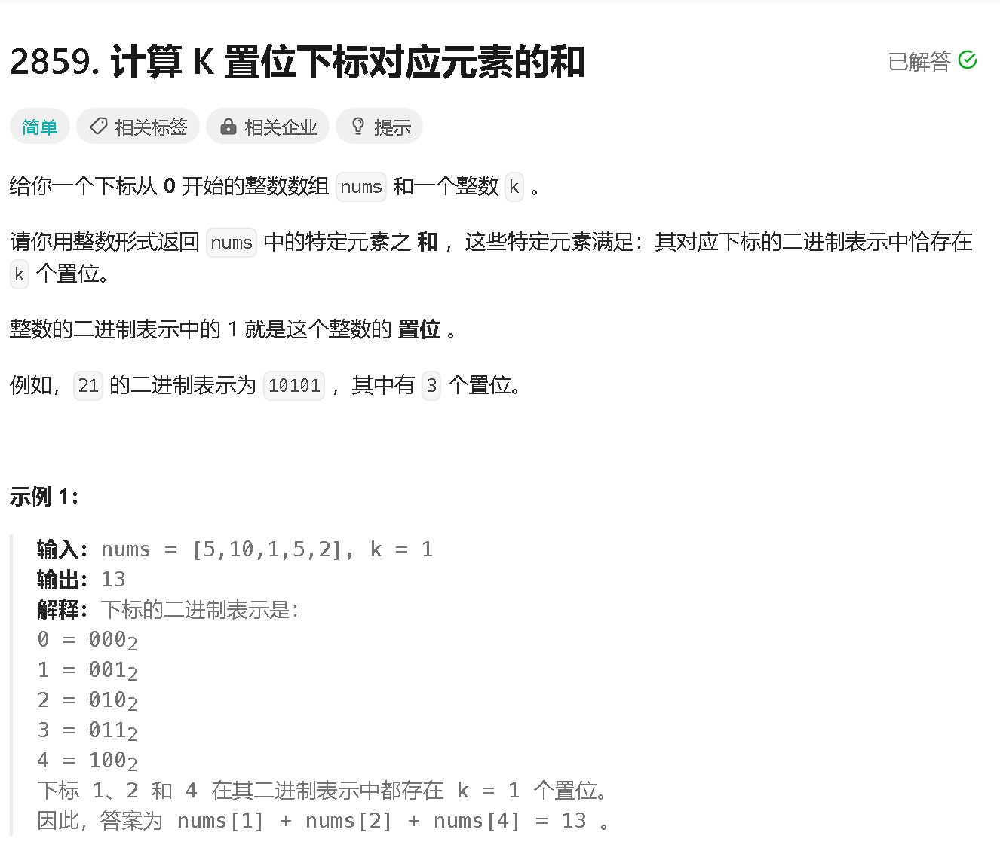
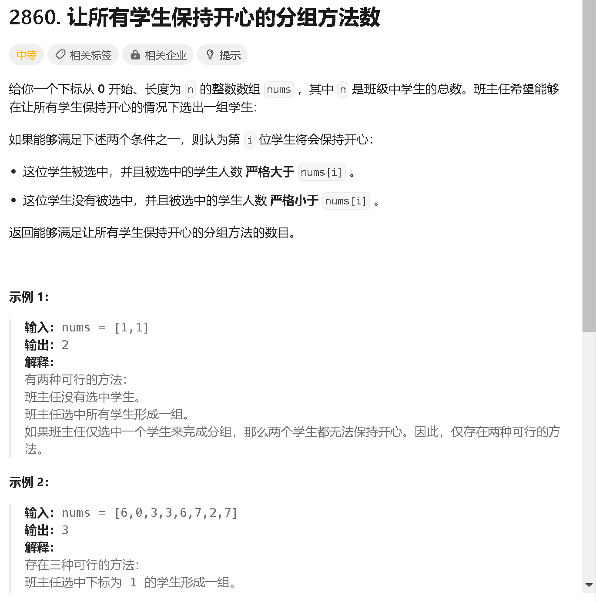
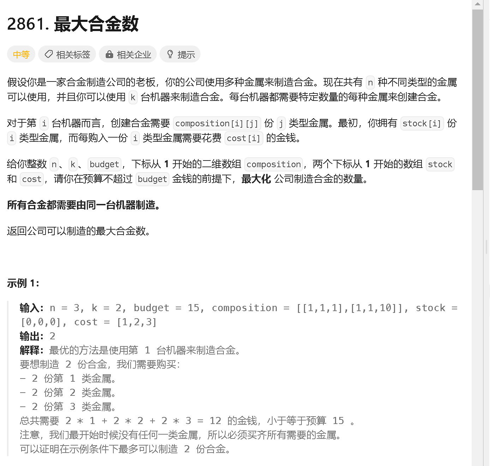
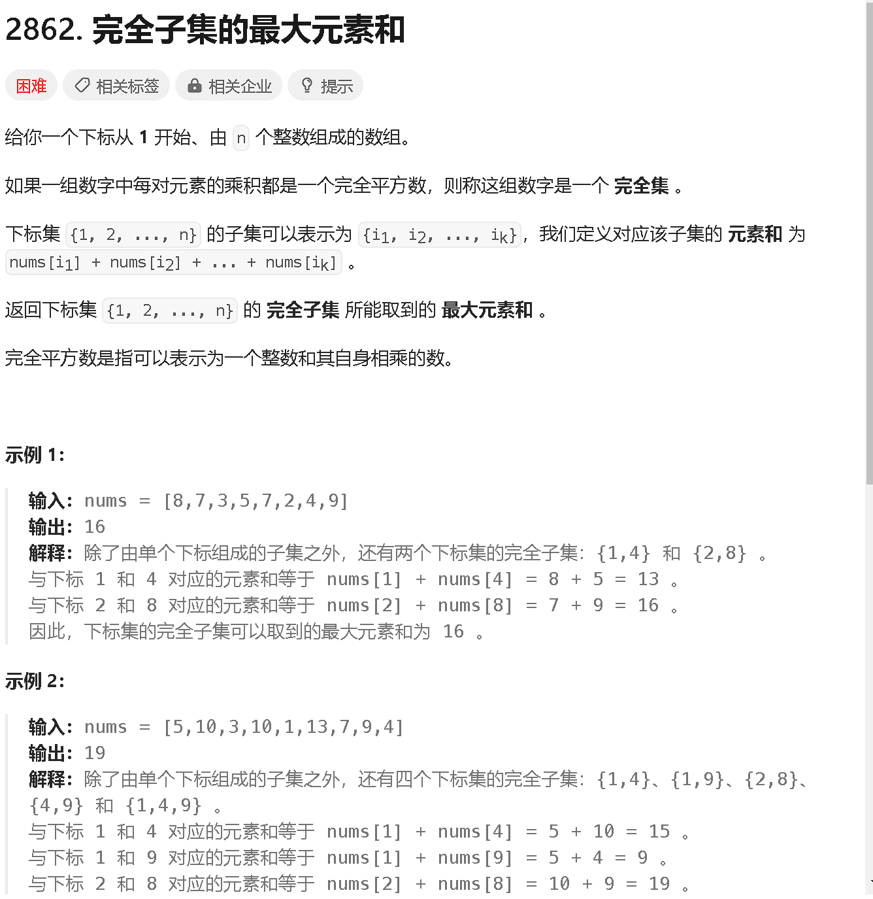

### a

[https://leetcode.cn/problems/sum-of-values-at-indices-with-k-set-bits/description/](https://leetcode.cn/problems/sum-of-values-at-indices-with-k-set-bits/description/)



```java
class Solution {
    public int sumIndicesWithKSetBits(List<Integer> nums, int k) {
        int res = 0;
        for (int i = 0; i < nums.size(); i ++) {
            int x = nums.get(i);
            if (getone(i) == k) {
                res += x;
            }
        }
        return res;
    }
    public int getone(int x) {
        int cnt = 0;
        while (x != 0) {
            if ((x & 1) == 1) cnt ++;
            x >>= 1;
        }
        return cnt;
    }
}
```

### b

[https://leetcode.cn/problems/happy-students/description/](https://leetcode.cn/problems/happy-students/description/)



```java

```

### c

[https://leetcode.cn/problems/maximum-number-of-alloys/description/](https://leetcode.cn/problems/maximum-number-of-alloys/description/)



```java

```

### d

[https://leetcode.cn/problems/maximum-element-sum-of-a-complete-subset-of-indices/description/](https://leetcode.cn/problems/maximum-element-sum-of-a-complete-subset-of-indices/description/)



```java

```