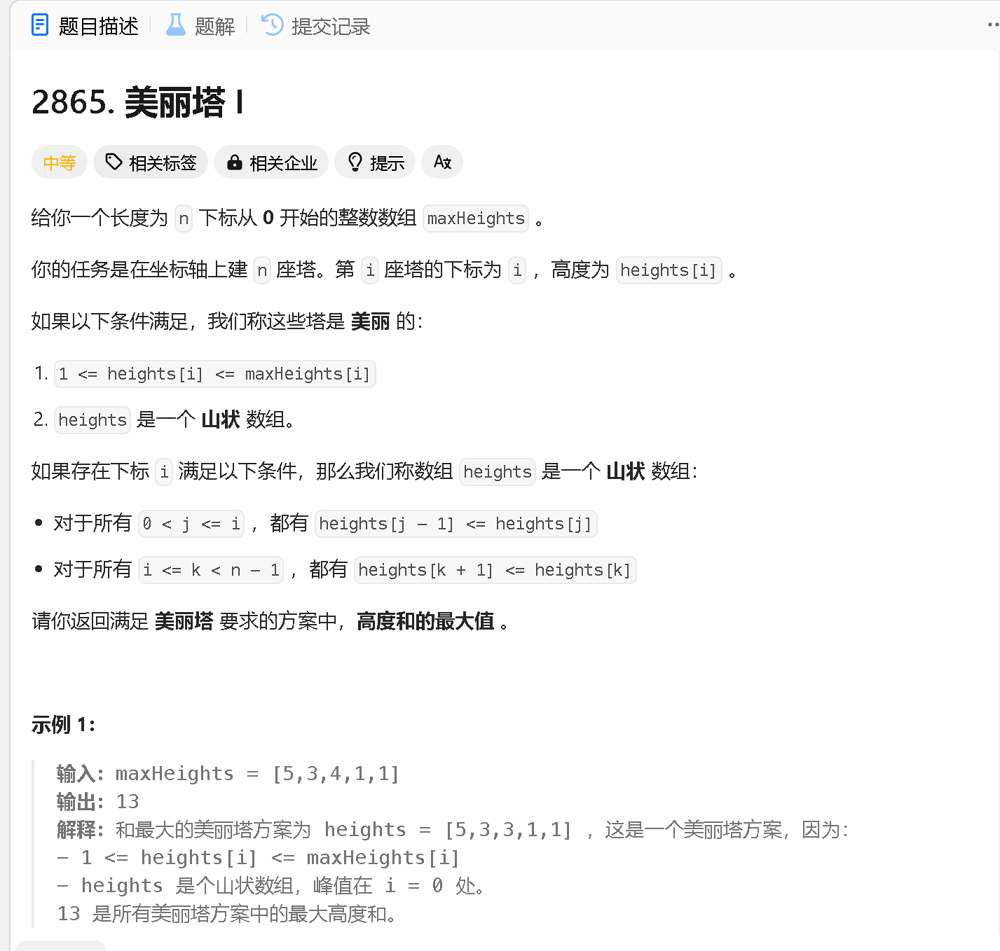

### a

[https://leetcode.cn/problems/maximum-odd-binary-number/description/](https://leetcode.cn/problems/maximum-odd-binary-number/description/)


```java
class Solution {
    public String maximumOddBinaryNumber(String s) {
        int cnt = 0;

        for (int i = 0; i < s.length(); i ++) {
            if (s.charAt(i) == '1') cnt ++;
        }

        int len = s.length() - cnt;

        StringBuilder res = new StringBuilder();
        while (cnt > 1)  {
            res.append(1);
            cnt --;
        }

        for (int i = 0; i < len; i ++) {
            res.append(0);
        }

        if (cnt == 1) res.append(1);

        return res.toString();

    }
}
```

```java
public class Solution {
    public String maximumOddBinaryNumber(String s) {
        int cnt1 = (int) s.chars().filter(c -> c == '1').count();
        return "1".repeat(cnt1 - 1) + "0".repeat(s.length() - cnt1) + "1";
    }
}
```

### b

[https://leetcode.cn/problems/beautiful-towers-i/description/](https://leetcode.cn/problems/beautiful-towers-i/description/)



```java

```