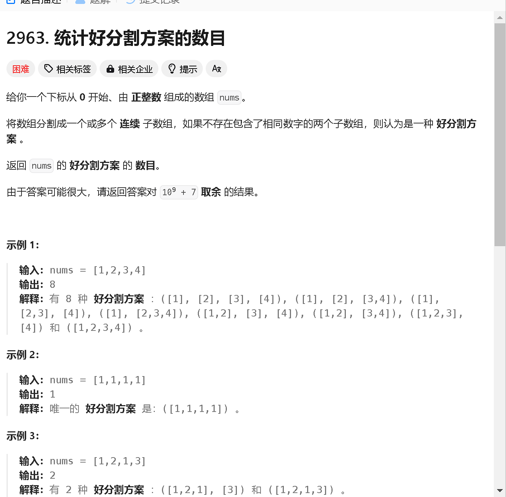

### a

[https://leetcode.cn/problems/count-tested-devices-after-test-operations/description/](https://leetcode.cn/problems/count-tested-devices-after-test-operations/description/)


```java
class Solution {
    public int countTestedDevices(int[] batteryPercentages) {
        int res = 0;

        int n = batteryPercentages.length;
        for (int i = 0; i < n; i ++) {
            if (batteryPercentages[i] - res > 0) {
                res ++;
            } 
        }
        return res;
    }
}
```

### b

[https://leetcode.cn/problems/double-modular-exponentiation/description/](https://leetcode.cn/problems/double-modular-exponentiation/description/)


```java
class Solution {
    public List<Integer> getGoodIndices(int[][] variables, int target) {
         int n = variables.length;
        List<Integer> res = new ArrayList<>(n);

       
        for (int i = 0; i < n; i ++) {
            if (qmi(qmi(variables[i][0], variables[i][1], 10), variables[i][2], variables[i][3]) == target)  {
                res.add(i);
            }
        }
        return res;
    
    }
    public int qmi(int a, int b, int c) {
        int cnt = 1 % c, t = a;
        while (b != 0) {
            if ((b & 1) == 1) cnt = cnt * t % c;
            t = t * t % c;
            b >>= 1;
        }
        return cnt;
    }
}
```

### c

[https://leetcode.cn/problems/count-subarrays-where-max-element-appears-at-least-k-times/description/](https://leetcode.cn/problems/count-subarrays-where-max-element-appears-at-least-k-times/description/)


```java

```

### d

[https://leetcode.cn/problems/count-the-number-of-good-partitions/description/](https://leetcode.cn/problems/count-the-number-of-good-partitions/description/)



```java

```