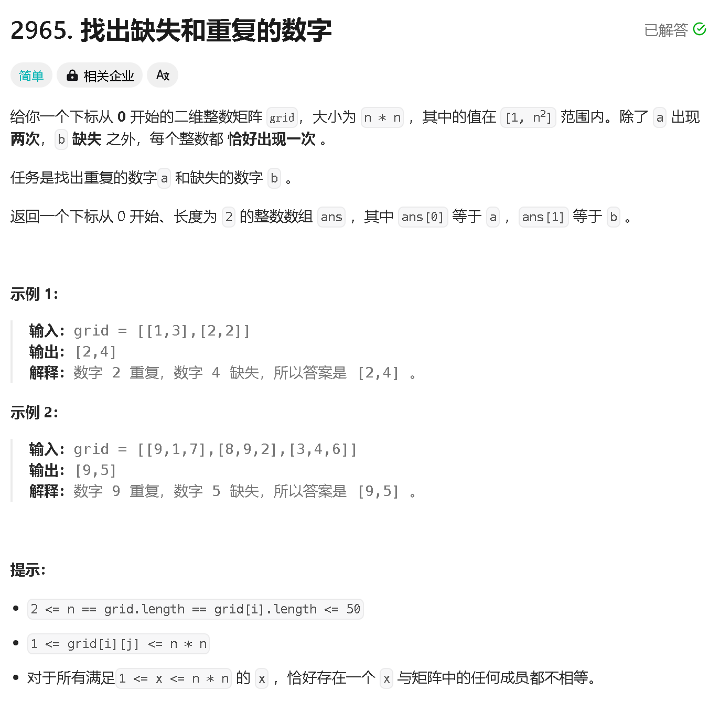
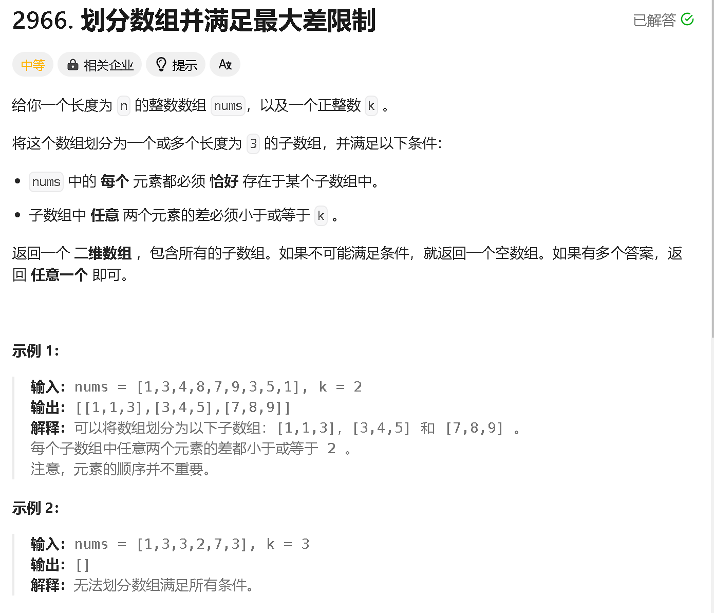
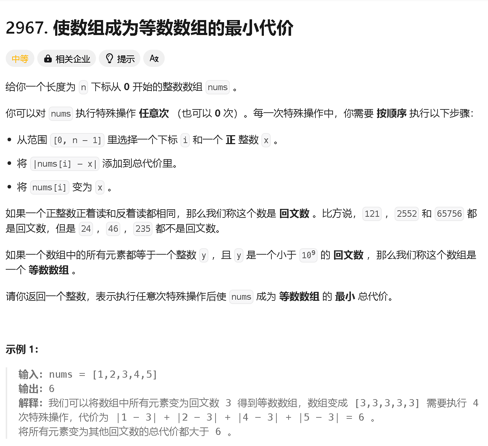
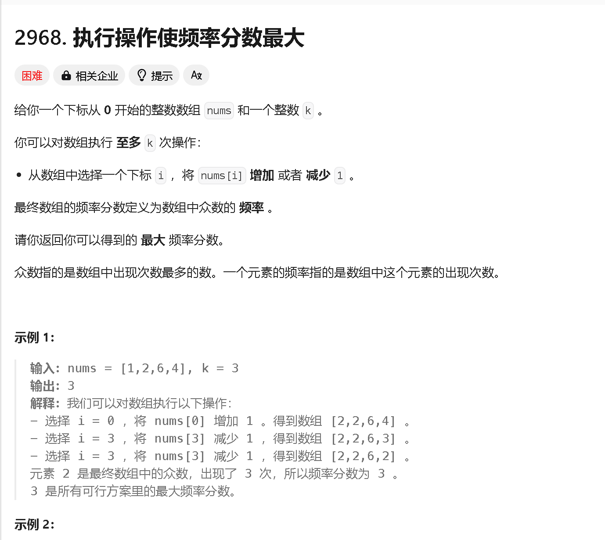

### a

[https://leetcode.cn/problems/find-missing-and-repeated-values/](https://leetcode.cn/problems/find-missing-and-repeated-values/)



```java
class Solution {
    public int[] findMissingAndRepeatedValues(int[][] grid) {
        int n = grid.length;

        int[] res = new int[2];
        int sum = (1 + n * n) * n * n / 2;
        // System.out.println(sum);
        Set<Integer> set = new HashSet<>();
        for (int i = 0; i < n; i ++) {
            for (int j = 0; j < n; j ++) {
                if (set.contains(grid[i][j])) {
                    res[0] = grid[i][j];
                } else {
                    set.add(grid[i][j]);
                }
                sum -= grid[i][j];
            }
        }
        res[1] = sum + res[0];
        return res;

    }
}
```

### b

[https://leetcode.cn/problems/divide-array-into-arrays-with-max-difference/description/](https://leetcode.cn/problems/divide-array-into-arrays-with-max-difference/description/)



```java
class Solution {
    public int[][] divideArray(int[] nums, int k) {
        Arrays.sort(nums);
        int n = nums.length;

        int[][] res = new int[n / 3][3];


        for (int i = 1, j = 0; i < n - 1; i += 3, j ++) {
            if (nums[i + 1] - nums[i - 1] > k ) {
                return new int[][]{};
            }
            res[j][0] = nums[i - 1];
            res[j][1] = nums[i];
            res[j][2] = nums[i + 1];
            //res[i / 3] = new int[]{nums[i - 2], nums[i - 1], nums[i]};
        }
        return res;
    }
}
```


### c

[https://leetcode.cn/problems/minimum-cost-to-make-array-equalindromic/description/](https://leetcode.cn/problems/minimum-cost-to-make-array-equalindromic/description/)



```java

```


### d

[https://leetcode.cn/problems/apply-operations-to-maximize-frequency-score/description/](https://leetcode.cn/problems/apply-operations-to-maximize-frequency-score/description/)



```java

```