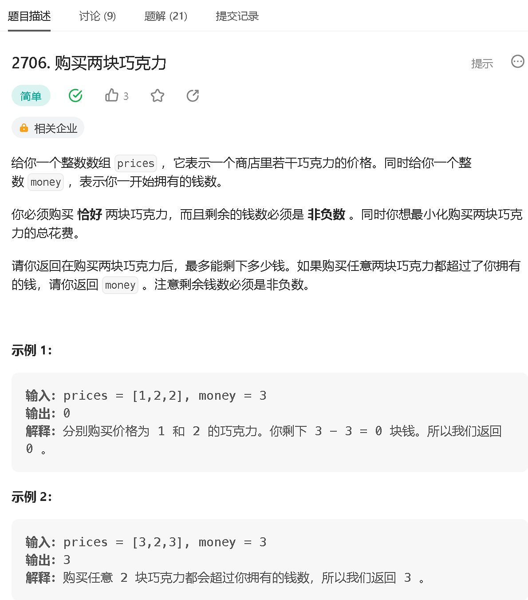
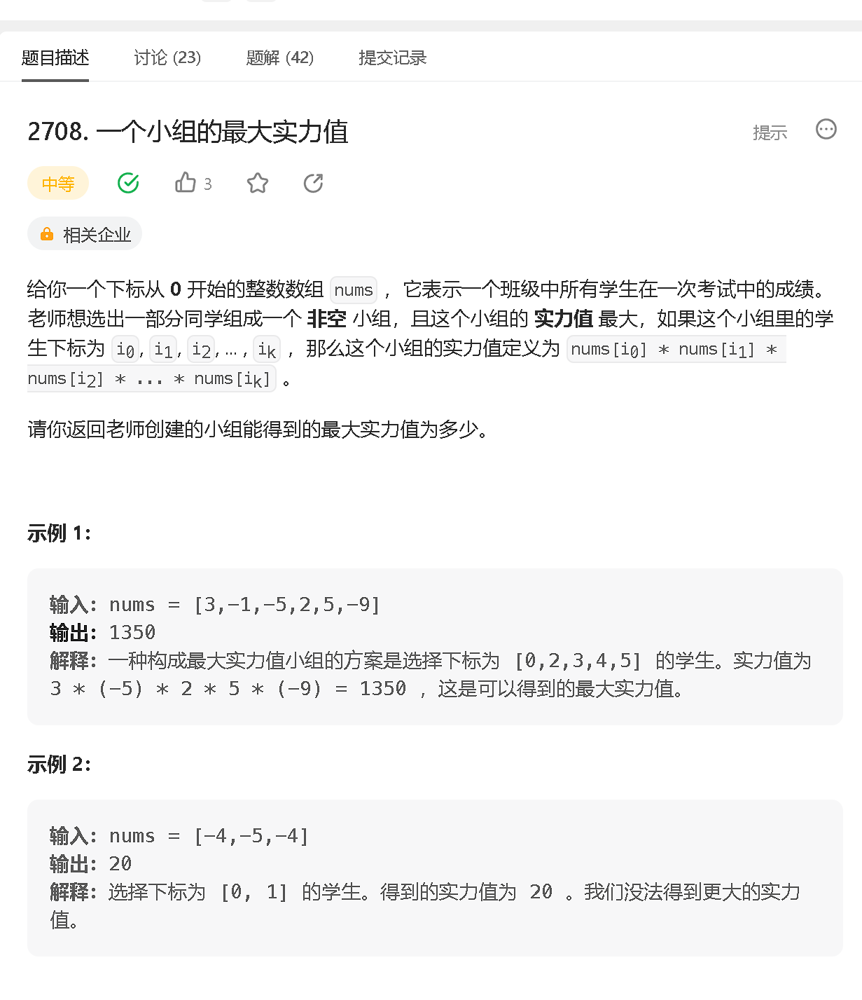
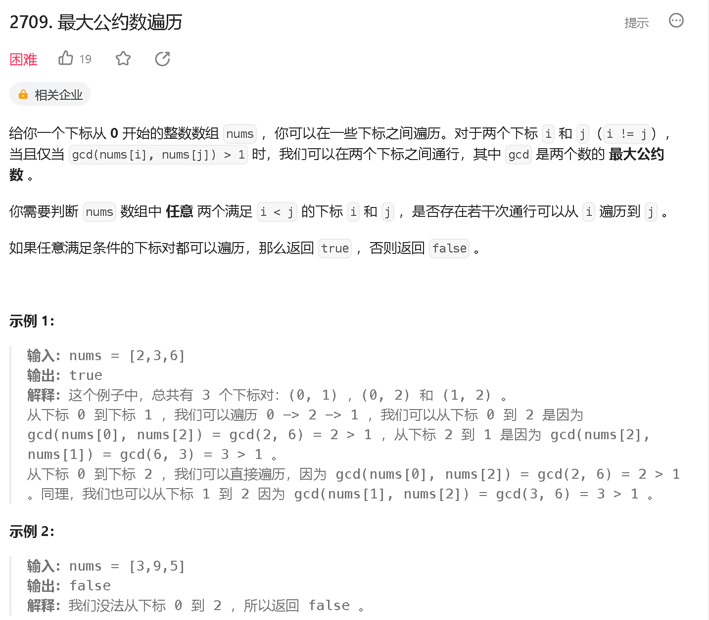

### a

[https://leetcode.cn/problems/buy-two-chocolates/](https://leetcode.cn/problems/buy-two-chocolates/)



```java
class Solution {
    public int buyChoco(int[] prices, int money) {
        Arrays.sort(prices);
        int res = money - prices[0] - prices[1];
        return res < 0 ? money : res;
    }
}
```

### b

[https://leetcode.cn/problems/extra-characters-in-a-string/](https://leetcode.cn/problems/extra-characters-in-a-string/)

### c

[https://leetcode.cn/problems/maximum-strength-of-a-group/](https://leetcode.cn/problems/maximum-strength-of-a-group/)



```java
class Solution {
    public long maxStrength(int[] nums) {
        Arrays.sort(nums);
        long res = 1;
        int n = nums.length, cnt = 0;
        for (int i = 0; i < n; i++) {
            if (res * nums[i] > 0 || (i + 1 < n && nums[i + 1] < 0)) {
                res *= nums[i];
                cnt++;
            }
        }
        return cnt > 0 ? res : nums[n - 1];
    }
}
```

### d

[https://leetcode.cn/problems/greatest-common-divisor-traversal/](https://leetcode.cn/problems/greatest-common-divisor-traversal/)



```java

```