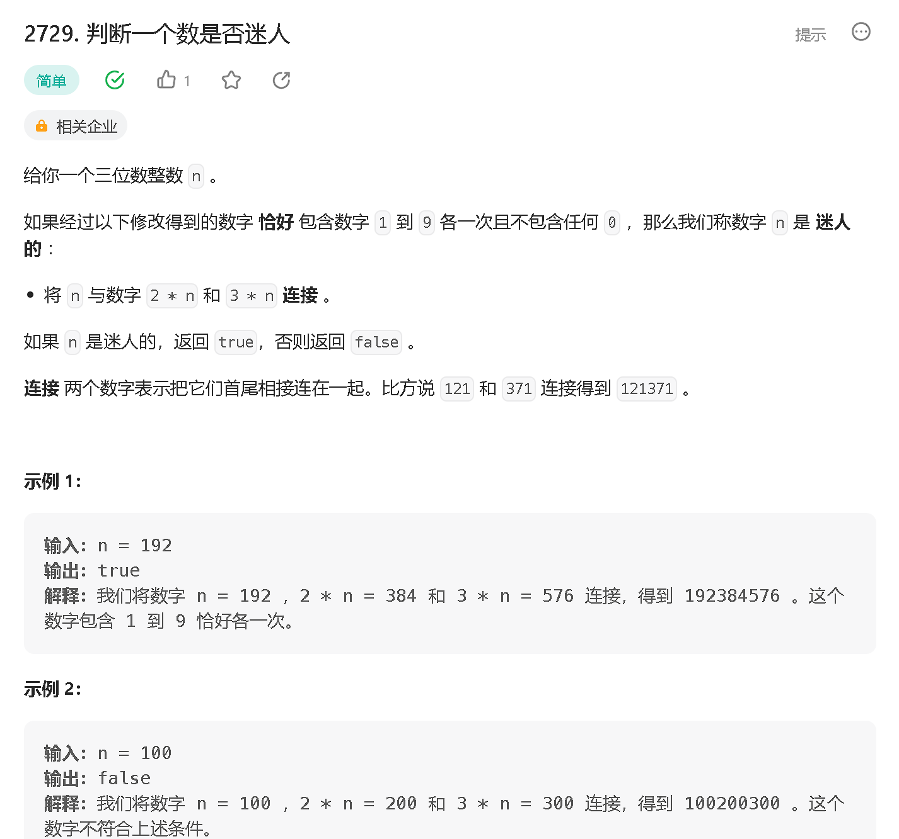
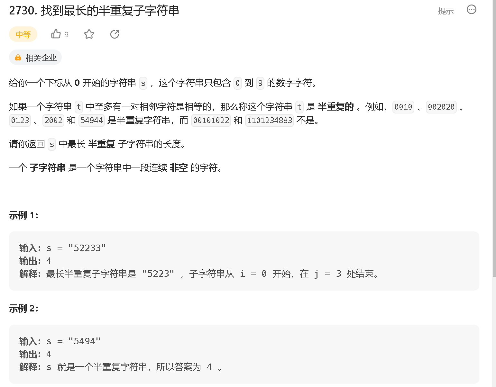
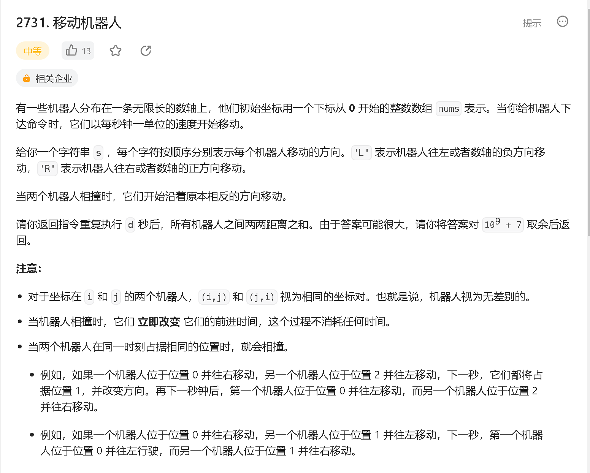
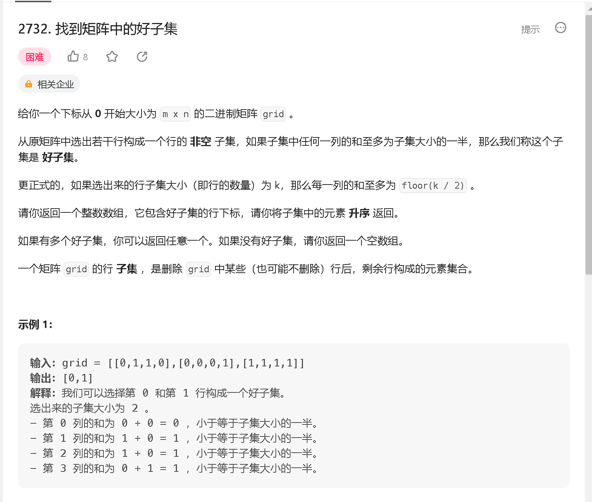

### a

[https://leetcode.cn/problems/check-if-the-number-is-fascinating/](https://leetcode.cn/problems/check-if-the-number-is-fascinating/)



```java
class Solution {
    public boolean isFascinating(int n) {
        int[] st = new int[10];

        StringBuilder s = new StringBuilder();
        s.append(n + "" + n * 2 + "" + n * 3);
        for (int i = 0; i < s.length(); i ++)  {
            st[s.charAt(i) - '0'] ++;
        }
        for (int i = 1; i < 10; i ++) {
            if (st[i] != 1) return false;
        }
        return st[0] == 0;

    }
}
```

### b

[https://leetcode.cn/problems/find-the-longest-semi-repetitive-substring/](https://leetcode.cn/problems/find-the-longest-semi-repetitive-substring/)



```java

```

### c

[https://leetcode.cn/problems/movement-of-robots/](https://leetcode.cn/problems/movement-of-robots/)



```java

```

### d

[https://leetcode.cn/problems/find-a-good-subset-of-the-matrix/](https://leetcode.cn/problems/find-a-good-subset-of-the-matrix/)



```java

```


