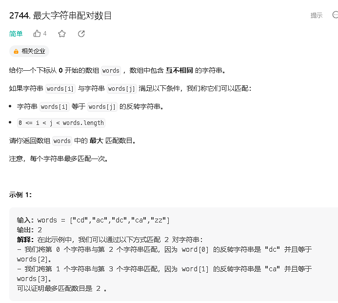
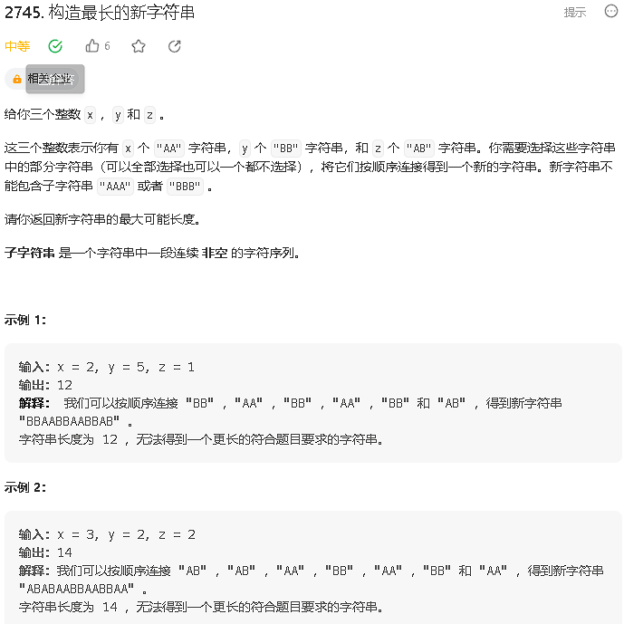
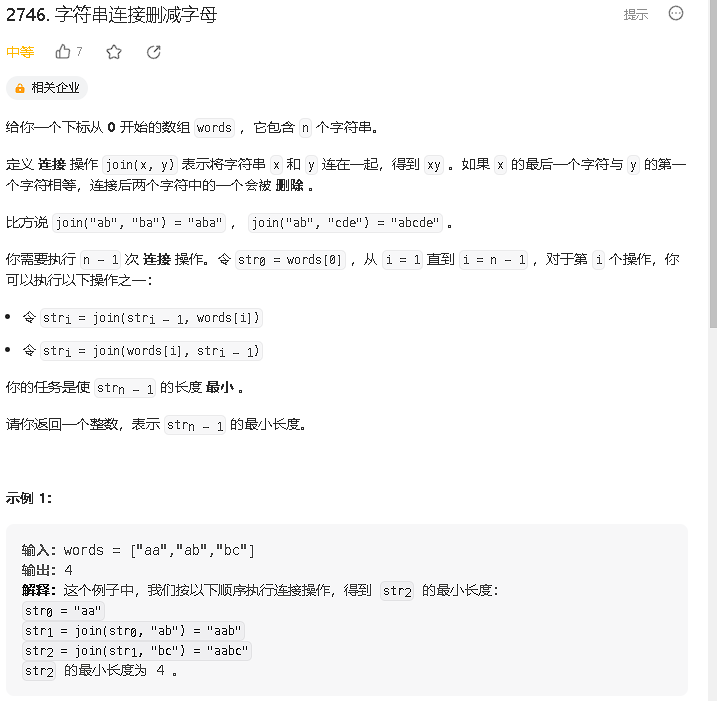
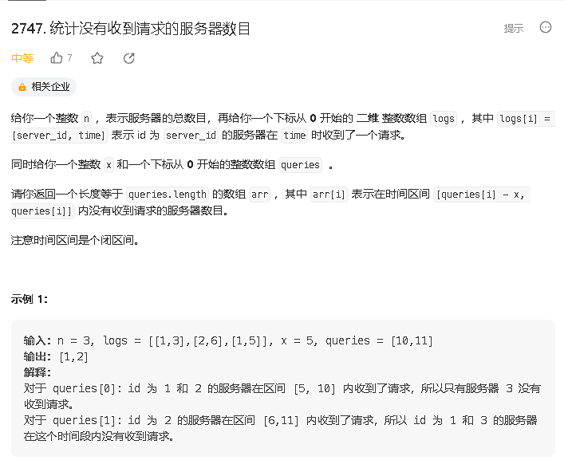

### a

[https://leetcode.cn/problems/find-maximum-number-of-string-pairs/](https://leetcode.cn/problems/find-maximum-number-of-string-pairs/)



```java
class Solution {
    public int maximumNumberOfStringPairs(String[] words) {
        Set<String> set = new HashSet<>();

        int res = 0;
        for (int i = 0; i < words.length; i ++) {
            String a = words[i];
            if (set.contains(a)) {
                res ++;
                set.remove(a);
            } else {
                set.add(new StringBuilder(a).reverse().toString());
            }
        }
        return res;
    }
}
```

### b

[https://leetcode.cn/problems/construct-the-longest-new-string/description/](https://leetcode.cn/problems/construct-the-longest-new-string/description/)



```java
class Solution {
    public int longestString(int x, int y, int z) {
        return (Math.min(x, y) * 2 + (x != y ? 1 : 0) + z) * 2;
    }
}
```

### c

[https://leetcode.cn/problems/decremental-string-concatenation/](https://leetcode.cn/problems/decremental-string-concatenation/)



```java

```

### d 

[https://leetcode.cn/problems/count-zero-request-servers/](https://leetcode.cn/problems/count-zero-request-servers/)



```java


```