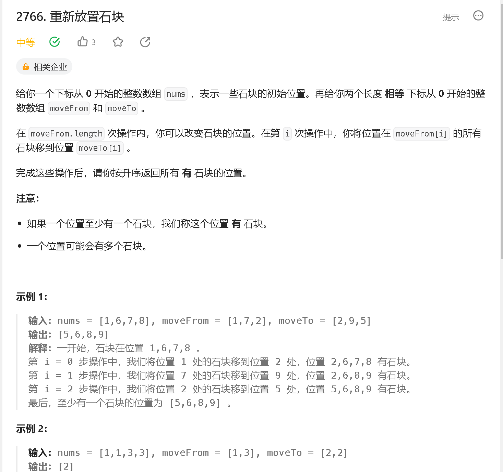

### a

[https://leetcode.cn/problems/longest-alternating-subarray/description/](https://leetcode.cn/problems/longest-alternating-subarray/description/)


```java
class Solution {
    public int alternatingSubarray(int[] nums) {
        int res = -1, n = nums.length;

        for (int i = 0; i < n; i ++) {
            int l = i + 1, cnt = 0;
            while (l < n) {
                if (cnt == 0 && nums[l] - nums[l - 1] == 1) {
                    cnt ++;
                    l ++;
                } else if (cnt == 1 && nums[l] - nums[l - 1] == -1) {
                    cnt = 0;
                    l ++;
                } else {
                    break;
                }
            }
            if (l == i + 1) continue;
            res = Math.max(res, l - i);
        }

        return res;
    }
}
```

### b

[https://leetcode.cn/problems/relocate-marbles/description/](https://leetcode.cn/problems/relocate-marbles/description/)



```java
class Solution {
    public List<Integer> relocateMarbles(int[] nums, int[] moveFrom, int[] moveTo) {

        Set<Integer> set = new HashSet<>();

        for (int i = 0; i < nums.length; i ++) set.add(nums[i]);

        for (int i = 0; i < moveFrom.length; i ++) {
            set.remove(moveFrom[i]);
            set.add(moveTo[i]);
        }

        return set.stream().sorted().toList();
    }
}
```

### c 

[https://leetcode.cn/problems/partition-string-into-minimum-beautiful-substrings/](https://leetcode.cn/problems/partition-string-into-minimum-beautiful-substrings/)


```java

```


### d

[https://leetcode.cn/problems/number-of-black-blocks/](https://leetcode.cn/problems/number-of-black-blocks/)


```java

```