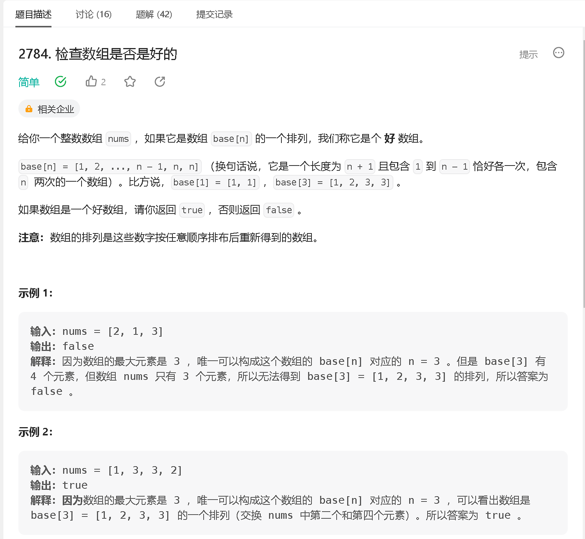
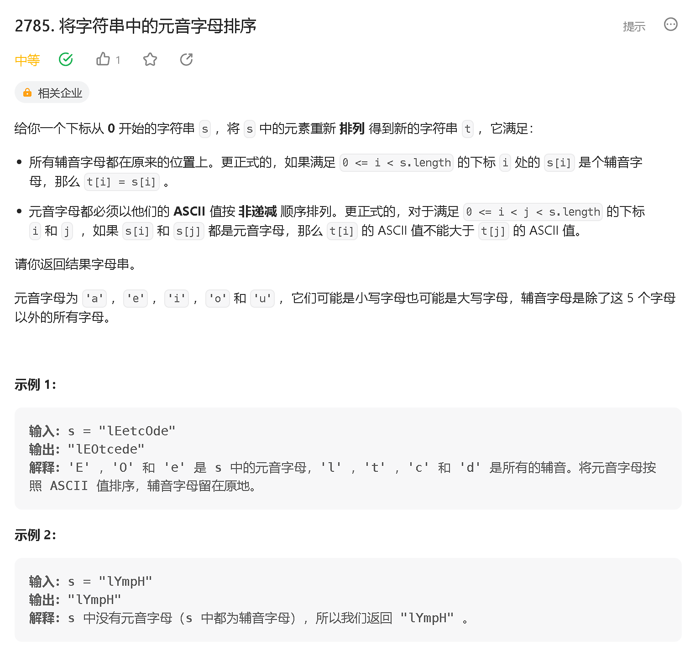
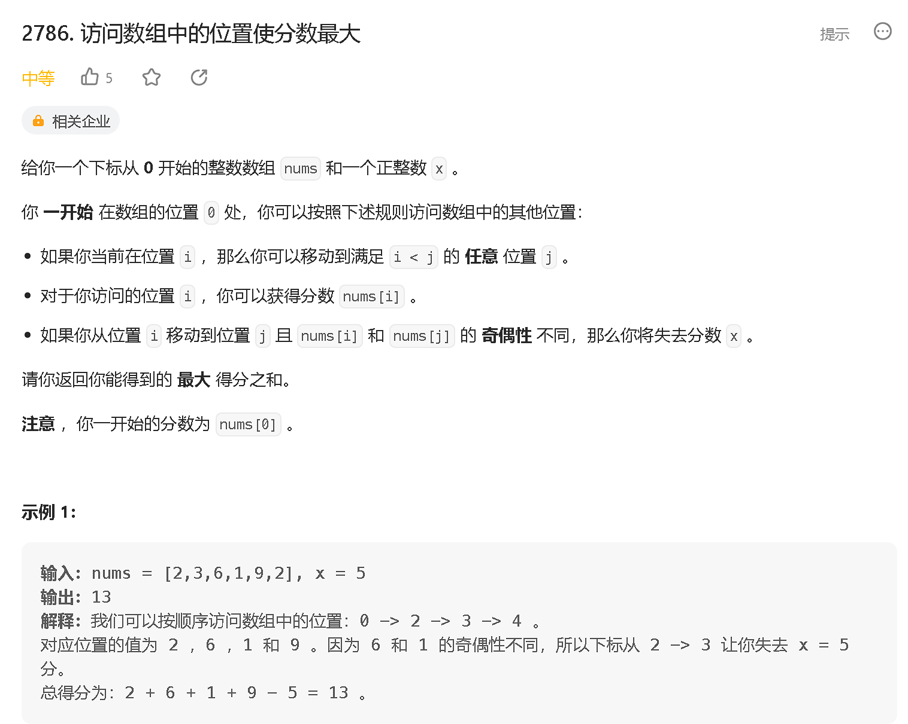
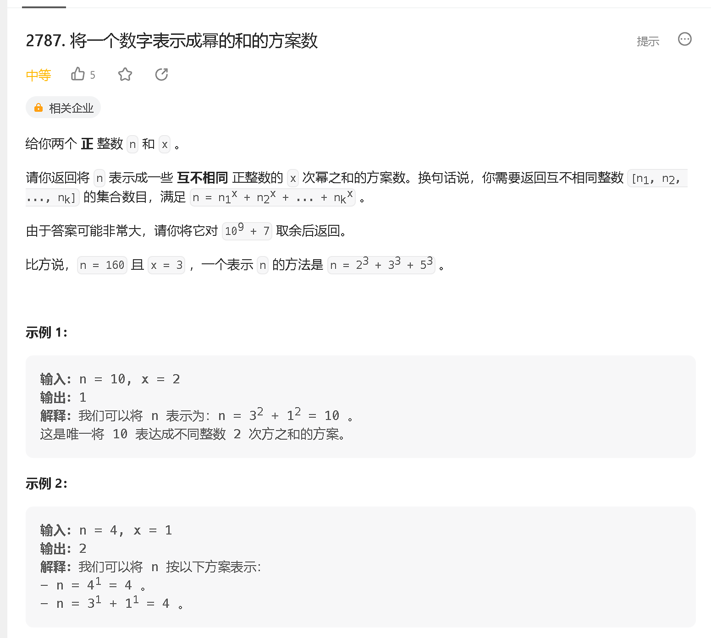

### a

[https://leetcode.cn/problems/check-if-array-is-good/](https://leetcode.cn/problems/check-if-array-is-good/)



```java
class Solution {
    public boolean isGood(int[] nums) {
        int n =  nums.length - 1;
        int cnt = 0;
        Set<Integer> set = new HashSet<>();
        for (int x : nums) {
            if (x > n) return false;
            if (n == x) {
              cnt ++;  
              continue;
            }
            if (set.contains(x)) return false;
            set.add(x);
        }
        return cnt == 2;
    }
}
```
### b

[https://leetcode.cn/problems/sort-vowels-in-a-string/description/](https://leetcode.cn/problems/sort-vowels-in-a-string/description/)



```java
class Solution {
    public String sortVowels(String s) {
        int[] arr = new int[10];
        String tar = "AEIOUaeiou";
        for (char c : s.toCharArray()) {
            int x = tar.indexOf(c);
            if (x >= 0) {
                arr[x] ++;
            }
        }

        StringBuilder res = new StringBuilder();
        for (char c : s.toCharArray()) {
            int x = tar.indexOf(c);
            if (x >= 0) {
                for (int i = 0; i < 10; i ++) {
                    if (arr[i] != 0) {
                        arr[i] --;
                        res.append(tar.charAt(i));
                        break;
                    }
                }
            } else {
                res.append(c);
            }
        }
        return res.toString();
    }
}
```
### c

[https://leetcode.cn/problems/visit-array-positions-to-maximize-score/](https://leetcode.cn/problems/visit-array-positions-to-maximize-score/)



```java
class Solution {
    public long maxScore(int[] nums, int x) {
        int n = nums.length;
        long[][] dp = new long[n][2];

        dp[0][nums[0] & 1] = nums[0];
        dp[0][1 - (nums[0] & 1)] = -0x3f3f3f; 
        for (int i = 1; i < n; i++) {
            dp[i][nums[i] & 1] = Math.max(dp[i - 1][nums[i] & 1] + nums[i], dp[i - 1][1 - (nums[i] & 1)] + nums[i] - x);
            dp[i][1 - (nums[i] & 1)] = dp[i - 1][1 - (nums[i] & 1)];
        }
        return Math.max(dp[n - 1][0] , dp[n -1][1]);

    }
}
```

### d


