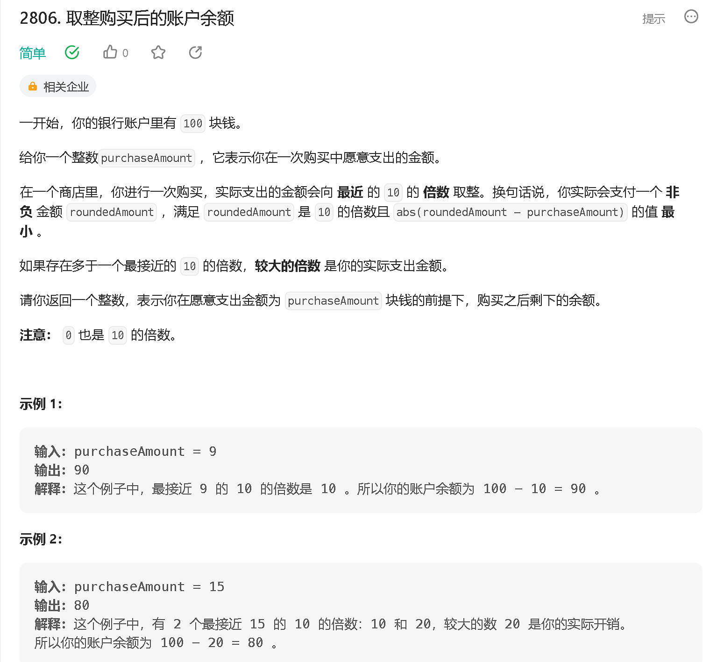
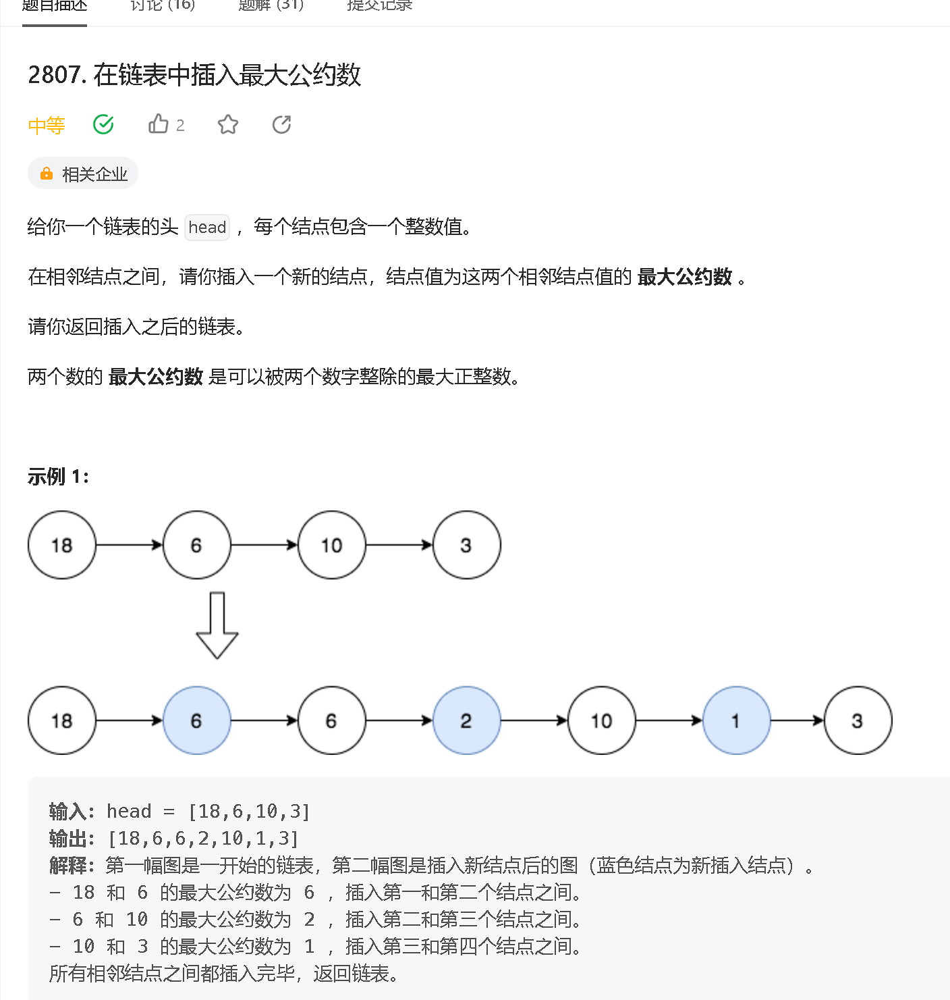
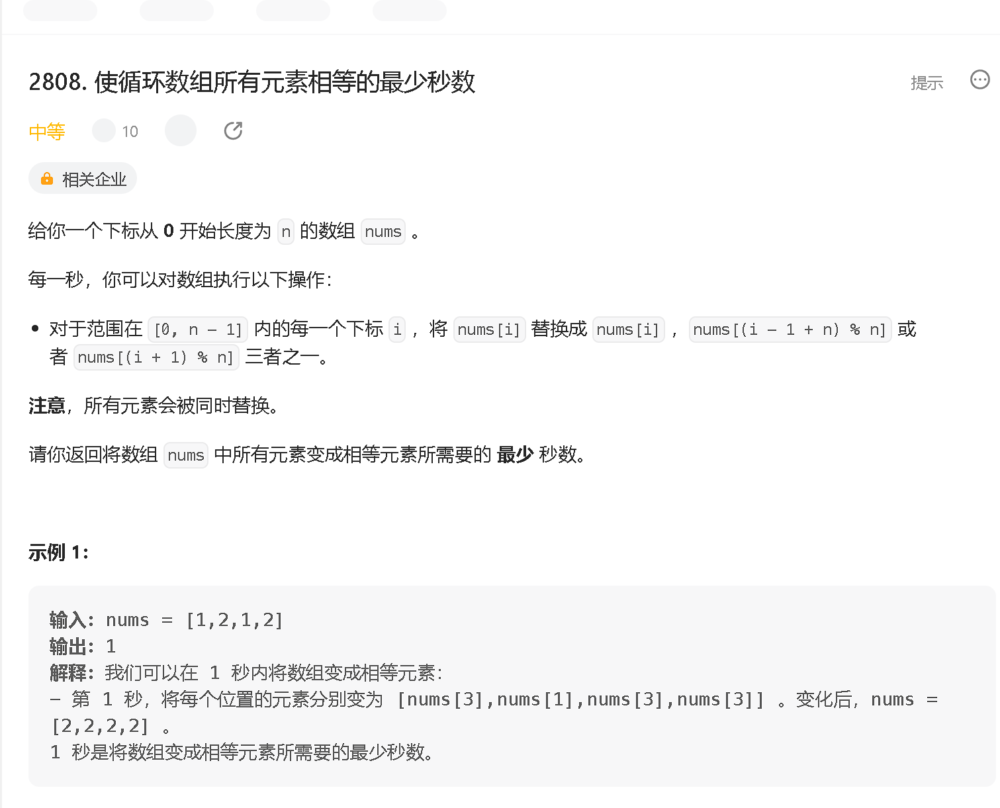
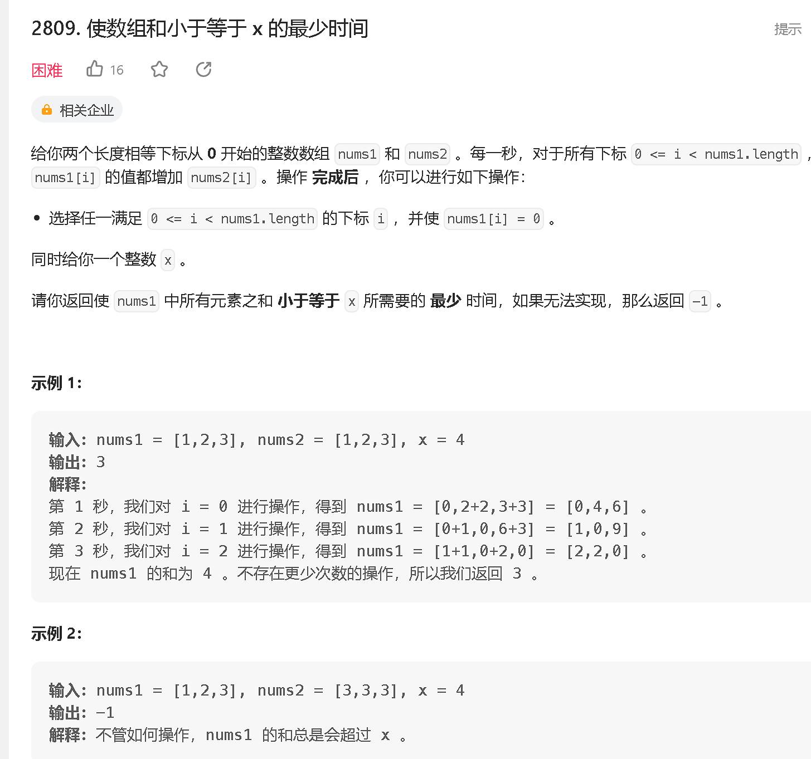

### a

[https://leetcode.cn/problems/account-balance-after-rounded-purchase/](https://leetcode.cn/problems/account-balance-after-rounded-purchase/)



```java
class Solution {
    public int accountBalanceAfterPurchase(int purchaseAmount) {
        return 100 - (purchaseAmount + 5) / 10 * 10;
    }
}
```

### b

[https://leetcode.cn/problems/insert-greatest-common-divisors-in-linked-list/](https://leetcode.cn/problems/insert-greatest-common-divisors-in-linked-list/)



```java
/**
 * Definition for singly-linked list.
 * public class ListNode {
 *     int val;
 *     ListNode next;
 *     ListNode() {}
 *     ListNode(int val) { this.val = val; }
 *     ListNode(int val, ListNode next) { this.val = val; this.next = next; }
 * }
 */
class Solution {
    public ListNode insertGreatestCommonDivisors(ListNode head) {
        ListNode a = head, b = head.next;

        while (b != null) {
            int gcd = getgcd(a.val, b.val);
            a.next = new ListNode(gcd, b);
            a = b;
            b = b.next;
        }
        return head;
    }
    public int getgcd(int a, int b) {
        return b == 0 ? a : getgcd(b, a % b);
    }
}
```

### c

[https://leetcode.cn/problems/minimum-seconds-to-equalize-a-circular-array/](https://leetcode.cn/problems/minimum-seconds-to-equalize-a-circular-array/)



```java

```

### d

[https://leetcode.cn/problems/minimum-time-to-make-array-sum-at-most-x/](https://leetcode.cn/problems/minimum-time-to-make-array-sum-at-most-x/)

