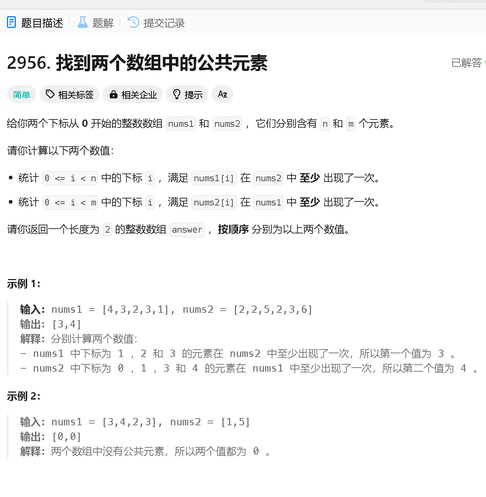
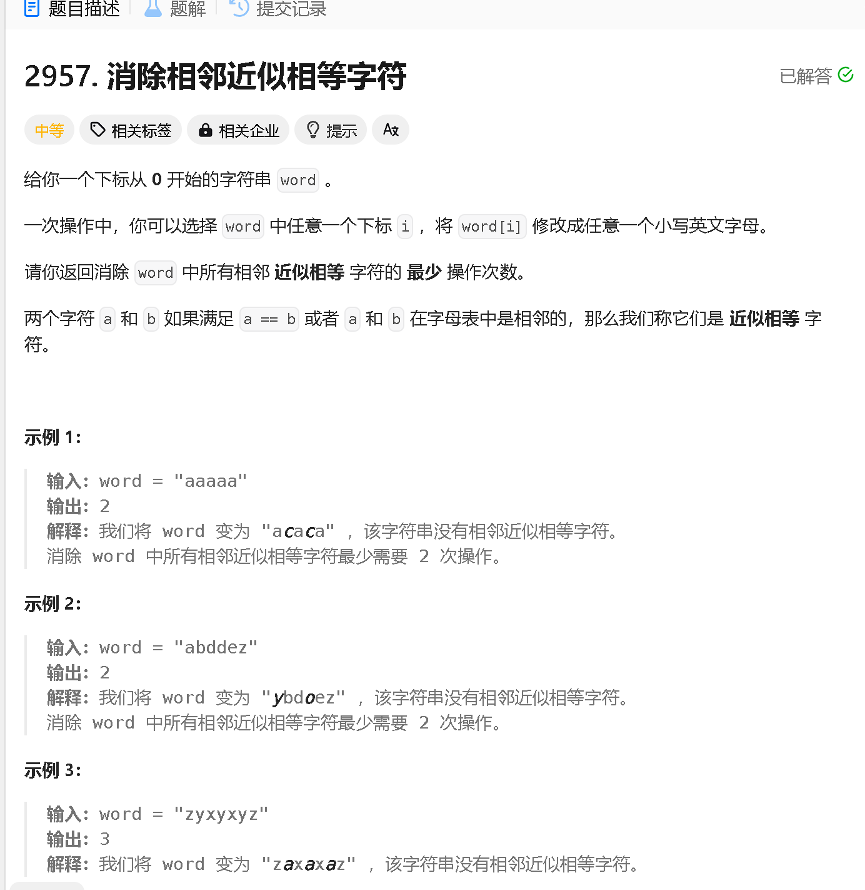
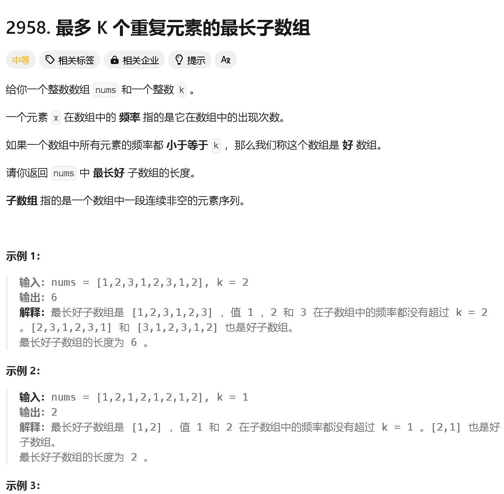
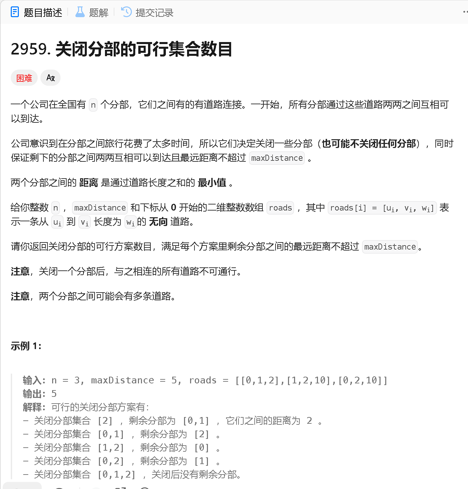

### a

[https://leetcode.cn/problems/find-common-elements-between-two-arrays/description/](https://leetcode.cn/problems/find-common-elements-between-two-arrays/description/)



```java
class Solution {
    public int[] findIntersectionValues(int[] nums1, int[] nums2) {
        HashSet<Integer> set1 = new HashSet<>();
        HashSet<Integer> set2 = new HashSet<>();
        for (int x : nums1) {
            set1.add(x);
        }
        for (int x : nums2) {
            set2.add(x);
        }

        int[] res = new int[2];
        for (int x : nums1) {
            if (set2.contains(x)) {
                res[0]++;
            }
        }
        for (int x : nums2) {
            if (set1.contains(x)) {
                res[1]++;
            }
        }
        return res;
    }
}
```

### b

[https://leetcode.cn/problems/remove-adjacent-almost-equal-characters/](https://leetcode.cn/problems/remove-adjacent-almost-equal-characters/)



```java
class Solution {
    public int removeAlmostEqualCharacters(String word) {
        int n = word.length(), res = 0;

        for (int i = 1; i < n; i ++) {
            if (Math.abs((int)(word.charAt(i - 1) - word.charAt(i))) <= 1) {
                res ++;
                i ++;
            }
        }
        return res;
    }
}
```

```java
class Solution {
    public int removeAlmostEqualCharacters(String word) {
        int[] dp = new int[2];
        for (int i = 1; i < word.length(); i++) {
            int current = Math.abs(word.charAt(i) - word.charAt(i - 1)) <= 1 ? dp[0] + 1 : dp[1];
            dp[0] = dp[1];
            dp[1] = current;
        }
        return dp[1];
    }
}

```

### c

[https://leetcode.cn/problems/length-of-longest-subarray-with-at-most-k-frequency/description/](https://leetcode.cn/problems/length-of-longest-subarray-with-at-most-k-frequency/description/)



```java

```

### d

[https://leetcode.cn/problems/number-of-possible-sets-of-closing-branches/description/](https://leetcode.cn/problems/number-of-possible-sets-of-closing-branches/description/)



```java

```