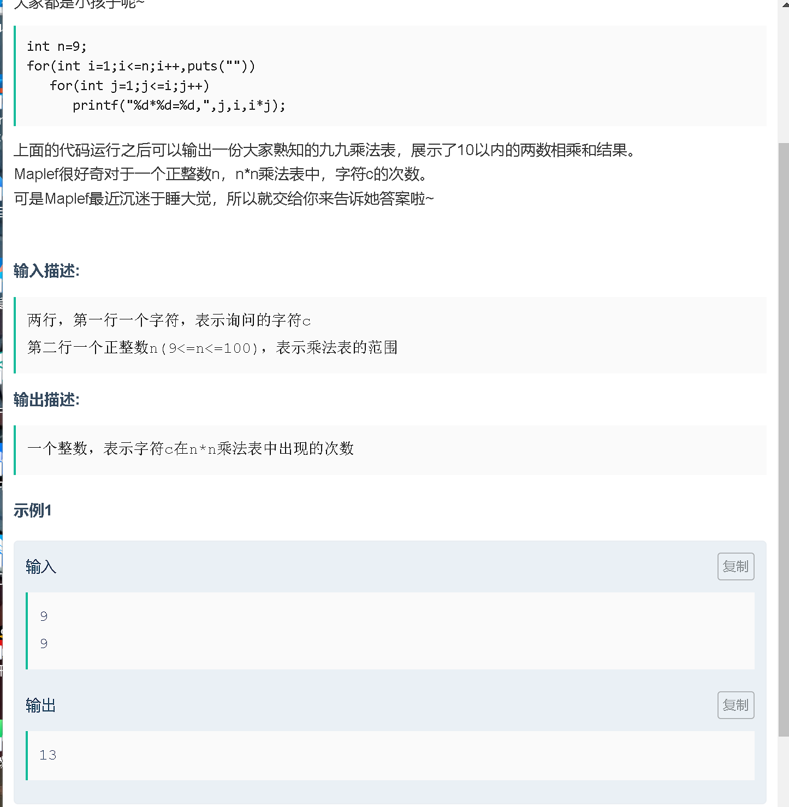
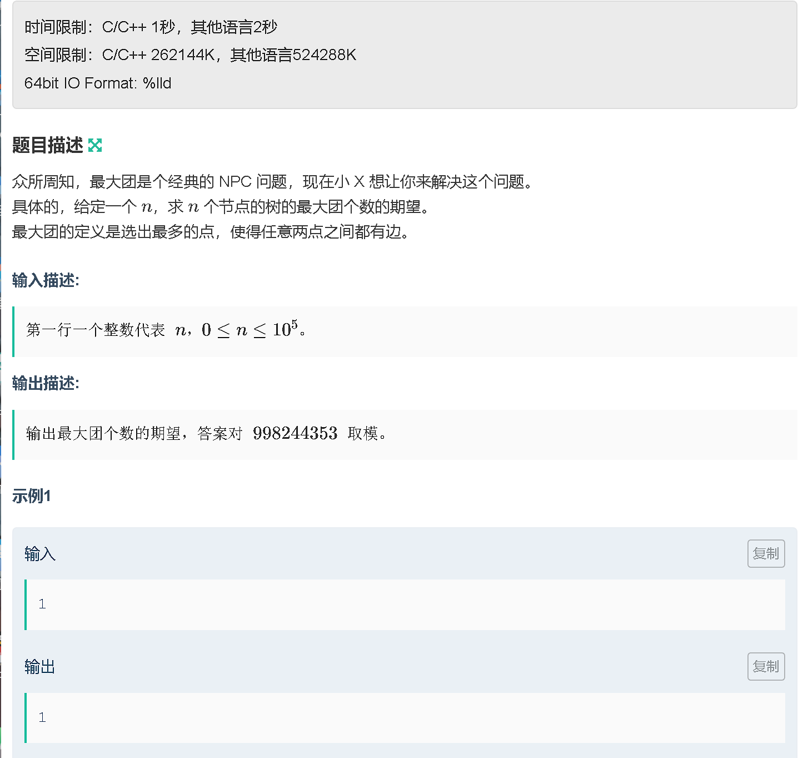
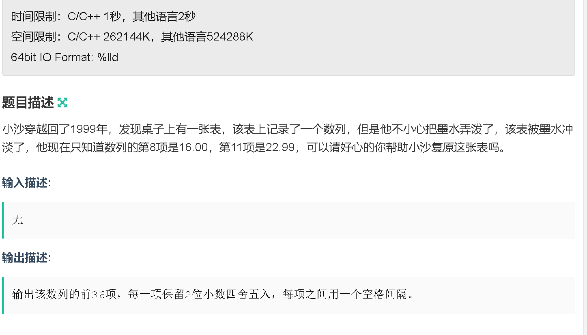
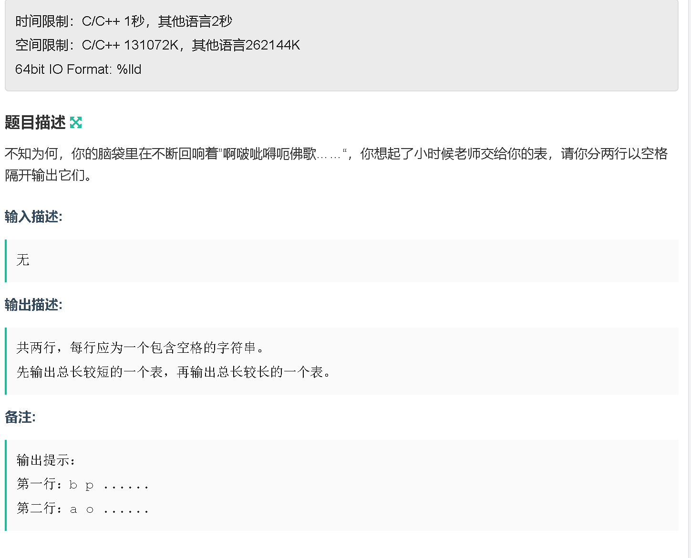

### A



```java
package com.java.nowcoder.childrens_day_2023;

import java.util.Scanner;

public class A {
    public static void main (String[] args) {
        Scanner sc = new Scanner(System.in);

        String s = sc.next();
        int n = sc.nextInt();
        int cnt =  0;
        StringBuilder res  = new StringBuilder();
        for (int i = 1; i <= n; i ++) {
            for (int j = 1; j <= i; j ++) {
                res.append(j + "*" + i + "=");
                res.append(i * j + ",");
            }
        }
        for (int i = 0; i < res.length(); i ++) {
            if (res.charAt(i) == s.charAt(0)) cnt ++;
        }
        System.out.println(cnt);
    }
}
```

### B



```java
import java.util.Scanner;

public class B {
    // 求 n 个节点的树的最大团个数的期望。最大团的定义是选出最多的点，使得任意两点之间都有边。
    // 只有三种情况: 0(n=0); 1(n=1); 2(other)
    public static void main (String[] args) {
        Scanner sc = new Scanner(System.in);

        int n = sc.nextInt();
        int res = -1;
        if (n == 0) res = 0;
        else if (n == 1) res = 1;
        else res = 2;

        System.out.println(res);
    }
}
```

### C



```java
package com.java.nowcoder.childrens_day_2023;

import java.util.Scanner;

public class C {
    public static void main (String[] args) {
        Scanner sc = new Scanner(System.in);
        // 元素周期表
        double[] arr = new double[]{0,1.01,4.00,6.94,9.01,10.81,12.01,14.01,16.00,19.00,20.18,22.99,24.31,26.98,28.09,30.97,32.06,35.45,39.95,
                39.10,40.08,44.96,47.87,50.94,52.00,54.94,55.85,58.93,58.69,63.55,65.38,69.72,72.63,74.92,78.96,79.90,83.80
        };

        for (int i = 1; i <= 36; i ++) {
            System.out.printf("%.2f ", arr[i]);
        }
    }
}
```

### D

### F



```java
package com.java.nowcoder.childrens_day_2023;

import java.util.Scanner;

public class F{
    public static void main (String[] args) {
        // 韵母表
        System.out.println("b p m f d t n l g k h j q x zh ch sh r z c s y w");
        System.out.println("a o e i u v ai ei ui ao ou iu ie ve er an en in un vn ang eng ing ong");
    }
}
```
### G


### H