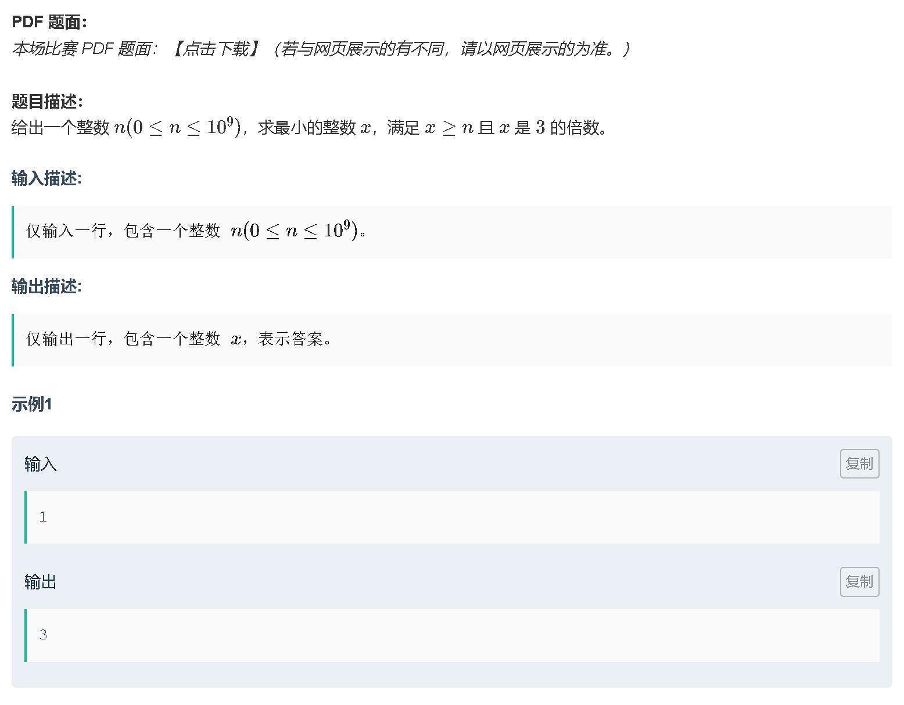
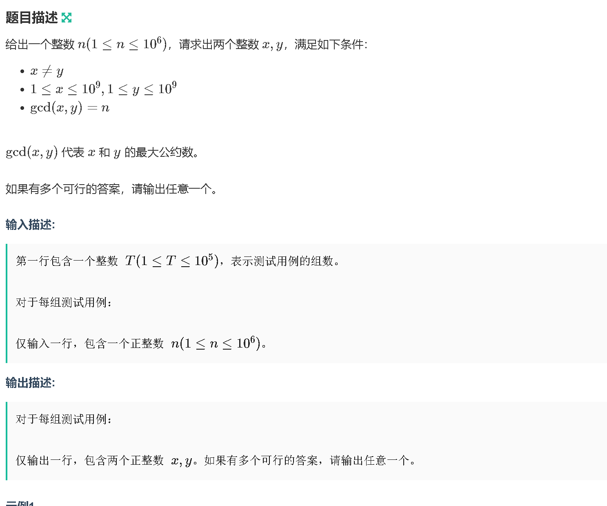
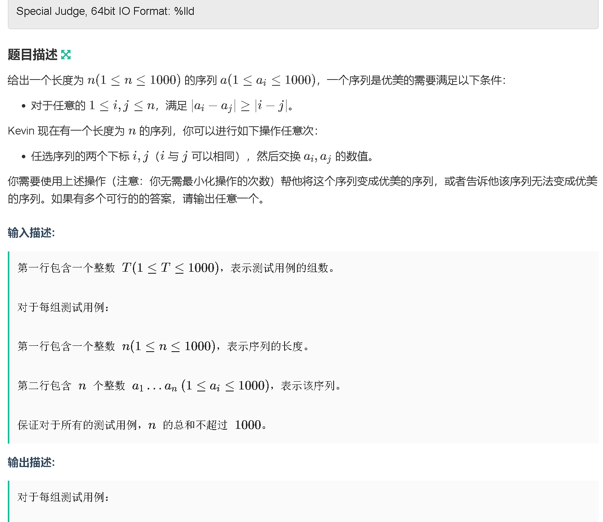

### a
[https://ac.nowcoder.com/acm/contest/57683/A](https://ac.nowcoder.com/acm/contest/57683/A)



```java
import java.util.Scanner;

public class A{
    public static void main (String[] args) {
        Scanner sc = new Scanner(System.in);

        int n = sc.nextInt();
        System.out.println(n % 3 == 0 ? n : n / 3 * 3 + 3);
    }
}
```
### b
[https://ac.nowcoder.com/acm/contest/57683/B](https://ac.nowcoder.com/acm/contest/57683/B)



```java
public class B {
    public static void main (String[] args) {
        Scanner sc = new Scanner(System.in);

        int t = sc.nextInt();
        while (t -- != 0) {
            int n = sc.nextInt();

            System.out.println(n + " " + 2 * n);

        }

    }
}

```

[https://ac.nowcoder.com/acm/contest/57683/C](https://ac.nowcoder.com/acm/contest/57683/C)



```java
import java.util.Scanner;
import java.util.Arrays;

public class C {
    public static void main(String[] args) {
        Scanner sc = new Scanner(System.in);

        int t = sc.nextInt();
        while (t -- != 0) {
            int n = sc.nextInt();
            int[] arr = new int[n];
            for (int i = 0; i < n; i ++) arr[i] = sc.nextInt();

            Arrays.sort(arr, 0, n);
            boolean st = false;
            for (int i = 0; i < n; i ++) {
                for (int j = 0; j < n; j ++) {
                    if (Math.abs(arr[i] - arr[j]) < Math.abs(i - j)) {
                        System.out.println("-1");
                        st = true;
                        break;
                    }
                }
                if (st) break;
            }
            if (!st) {
                for (int i = 0; i < n; i ++) System.out.println(arr[i] + " ");
            }
        }
    }
}
```