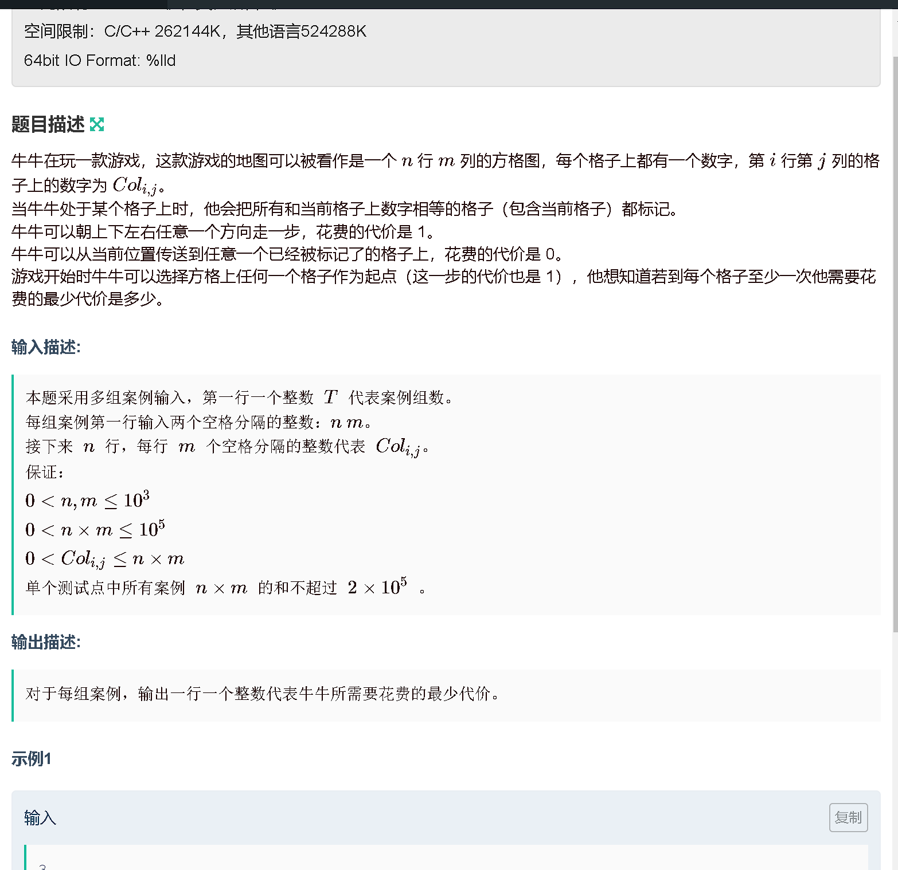
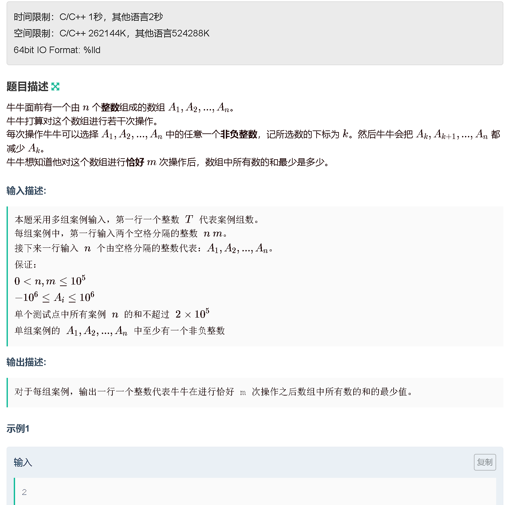
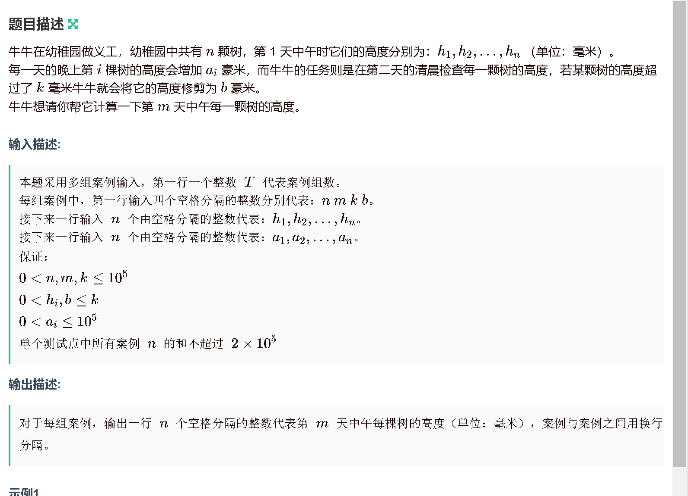

### a
[https://ac.nowcoder.com/acm/contest/59284/A](https://ac.nowcoder.com/acm/contest/59284/A)


```java
package com.java.nowcoder.contest_74;

import java.util.Scanner;

public class A {
    public static void main (String[] args) {
        Scanner sc = new Scanner(System.in);
        int x = sc.nextInt();

        int[] arr = new int[]{2, 3, 5, 7};
        boolean st = false;
        for (int i = 0; i < 4; i ++) {
            if (x % arr[i] == 0) {
                st = true;
            }
        }
        if (st) System.out.println("YES");
        else System.out.println("NO");
    }
}
```

### b
[https://ac.nowcoder.com/acm/contest/59284/B](https://ac.nowcoder.com/acm/contest/59284/B)


```java
package com.java.nowcoder.contest_74;

import java.util.Scanner;

public class B {
    public static void main (String[] args) {
        Scanner sc = new Scanner(System.in);

        int t = sc.nextInt();
        while (t -- != 0) {
            int n = sc.nextInt();


            int sum = 0;
            for (int i = 1; i <= n / 2; i ++) {
                if (sum + i + i + 1 > n) break;
                sum += i;
                System.out.print(i + " ");
            }
            if (n - sum != 0) System.out.print(n - sum);
            System.out.println();
        }
    }
}
```

### c
[https://ac.nowcoder.com/acm/contest/59284/C](https://ac.nowcoder.com/acm/contest/59284/C)



```java
package com.java.nowcoder.contest_74;

import java.util.Scanner;
import java.util.Set;
import java.util.HashSet;
public class C {
    public static final int N = 1010;
    public static int[][] arr = new int[N][N];

    public static void main (String[] args) {
        Scanner sc = new Scanner(System.in);

        int t = sc.nextInt();
        while (t -- != 0) {
            int n = sc.nextInt(), m = sc.nextInt();
            Set<Integer> set = new HashSet<Integer>();
            for (int i = 1; i <= n; i ++) {
                for (int j = 1; j <= m; j ++) {
                    arr[i][j] = sc.nextInt();
                    set.add(arr[i][j]);
                }
            }

            System.out.println(set.size());


        }
    }
}
```

### d

[https://ac.nowcoder.com/acm/contest/59284/D](https://ac.nowcoder.com/acm/contest/59284/D)



```java
package com.java.nowcoder.contest_74;


import java.util.Arrays;
import java.util.Scanner;

public class D {
    public static final int N = 100010;
    public static int[] arr = new int[N];
    public static long[] b = new long[N];


    public static void main (String[] args) {
        Scanner sc = new Scanner(System.in);

        int t = sc.nextInt();
        while (t -- != 0) {
            int n = sc.nextInt(), m = sc.nextInt();
            long sum = 0;
            for (int i = 0; i < n; i ++) {
                arr[i] = sc.nextInt();
                sum += arr[i];
            }
            int k = 0;
            for (int i = n - 1; i >= 0; i --) {
                if (arr[i] > 0) {
                    b[k ++] = (long)arr[i] * (n - i);
                }
            }
            long res = 0;
            Arrays.sort(b, 0, k);
            for (int i = k - 1, j = 0; i >= 0 && j < Math.min(n, m); j ++, i --){
                res += b[i];
            }
            System.out.println(sum - res);

        }
    }
}
```

### e 

[https://ac.nowcoder.com/acm/contest/59284/E](https://ac.nowcoder.com/acm/contest/59284/E)



```java
package com.java.nowcoder.contest_74;

import java.util.Scanner;

public class E {
    public static final int N = 100010;
    public static long[] h = new long[N];
    public static long[] arr = new long[N];

    public static void main (String[] args) {
        Scanner sc = new Scanner(System.in);

        int t = sc.nextInt();
        while (t -- != 0) {
            int n = sc.nextInt(), m = sc.nextInt(), k = sc.nextInt(), b = sc.nextInt();
            m --;
            for (int i = 0; i < n; i ++) h[i] = sc.nextLong();
            for (int i = 0; i < n; i ++) arr[i] = sc.nextLong();

            for (int i = 0; i < n; i ++) {
                if (h[i] + m  * arr[i] > k) {
                    long d = (k + 1) - h[i];
                    long c = m - (d + arr[i] - 1) / arr[i];
                    long p = (k + 1) - b;
                    long q = (p + arr[i] - 1) / arr[i];

                    System.out.print(b + c % q * arr[i] + " ");
                } else {
                    System.out.print(h[i] + m  * arr[i] + " ");
                }
            }
            System.out.println();

        }

    }
}
```